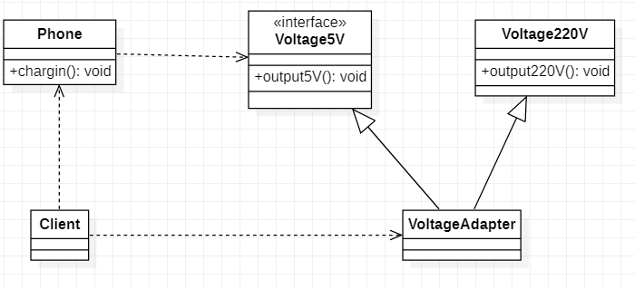
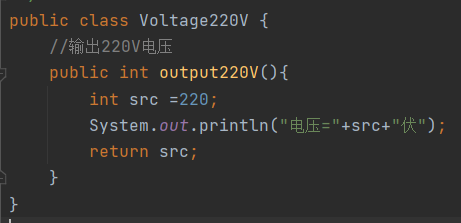

# 适配器模式

1. 适配器模式（Adapter Pattern）将某个类的接口转换成客户端期望的另一个接口表示，主的目的是兼容性，让原本因接口不匹配不能一起工作的两个类可以协同工作，其别名为包装器（Wrapper）
2. 适配器模式属于结构性模式
3. 主要分为三类：类适配器、对象适配器、接口适配器

## 适配器工作原理

1. 适配器模式：将一个类的接口转换成另一个接口，让`原本接口不兼容的类可以`兼容
2. 从用户的角度看不到被适配者，是解耦的
3. 用户调用适配器转化出来的目标接口方法，适配器再调用被适配者的相关接口方法
4. 用户收到反馈结果，感觉只是和目标接口交互

## 类适配器

### 基本介绍

> Adapter类，通过继承src类，实现dst类接口，完成src->dst的适配

### 类适配器的实现

> 以生活中充电器的例子来讲解适配器，我们的手机充电器本身相当于Adapter，220V交流电相当于src（被适配者），充电器接入手机接口输出的是5V直流电（目标），通过手机充电器将来220V转成5V

#### Voltage220V

> 输出220V电压的一个类

#### Voltage5V

> 一个5V电压的接口，定义输出5V电压的方法，给适配器实现

#### VoltageAdapter

> 一个适配器，继承了Voltage220V类实现Voltage5V接口，实现output5V方法，在output5V方法中获取获取22V电压进行处理，处理完成后并返回

#### Phone

> 手机充电类，有一个充电方法接收一个Voltage5V类型的接口，对手机进行充电

#### Client

#### 类适配器总结

1. 缺点：java是单继承机制，在类适配器中需要继承src类，这算是一个缺点，而且这里要求dst必须是接口，有一定的局限性
2. 缺点：src类的方法在Adapter中会暴露出来，也增加了使用的成本
3. 优点：由于其继承了src类，所以它可以根据需求重写src类的方法，使得Adapter的灵活性增强

## 对象适配器

### 对象适配器的实现

> 使用对象适配器对之前例子进行改进
>
> 对象适配器模式和类适配器模式基本相同，只是修改了Adapter类不在继承src类，而是持有src类的实例，以解决兼容性的问题，`即持有src类，实现dst接口，完成src->dst的适配`
>
> 根据“合成复用原则”，在系统中尽量使用关联关系类替代继承关系
>
> 对象适配器模式是适配器中最常用的一种

#### Voltage220V

> Voltage220V对象与之前无变化

#### Voltage5V

> Voltage5V对象与之前无变化

#### VoltageAdapter

> VoltageAdapter对象不在继承Voltage220V，而是通过聚合的方式聚合Voltage220V对象并且通过构造器方式得到Voltage220V实例

#### Phone

> Phone对象与之前无变化

#### Client

#### 对象适配器总结

1. 对象适配器和类适配器算是同一种实现，只不过实现方式不同，根据合成复用原则，使用组合代替继承，所以它解决了类适配器必须继承src的局限性问题，也不再要求dst必须是接口
2. 优点：使用成本更低，更加灵活

## 接口适配器

### 接口适配器的实现

> 当不需要实现接口提供的方法时，可先设计一个抽象类实现接口，并为该接口中每一个方法提供一个默认实现（空方法），那么该抽象类的子类可有选择的覆盖父类的某些方法来实现需求
>
> 适用于一个接口不想使用其所以的方法的情况

#### Voltage220V

> Voltage220V对象与之前无变化

#### Voltage5V

> Voltage5V对象与之前无变化

#### VoltageAdapter

> VoltageAdapter对象修改为抽象类，并且实现多个Voltage相关接口,提供所有接口的默认实现，当Client用到什么时自定义实现相应的方法即可

#### Phone

> Phone对象与之前无变化

#### Client

> Client在创建适配器时，按照自己的要求重写适配器的默认实现

