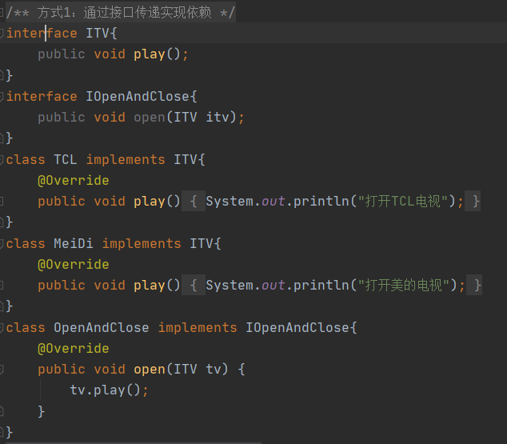
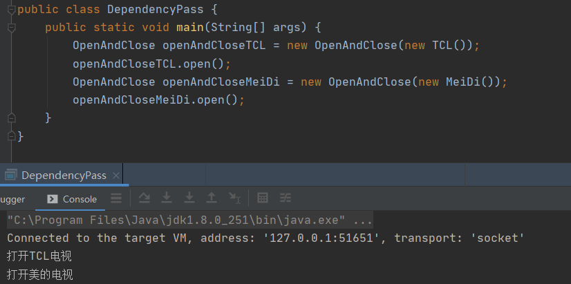
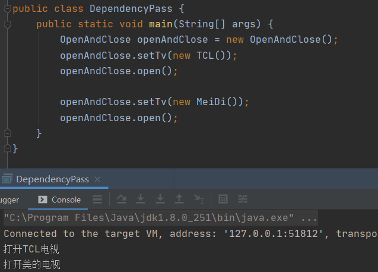
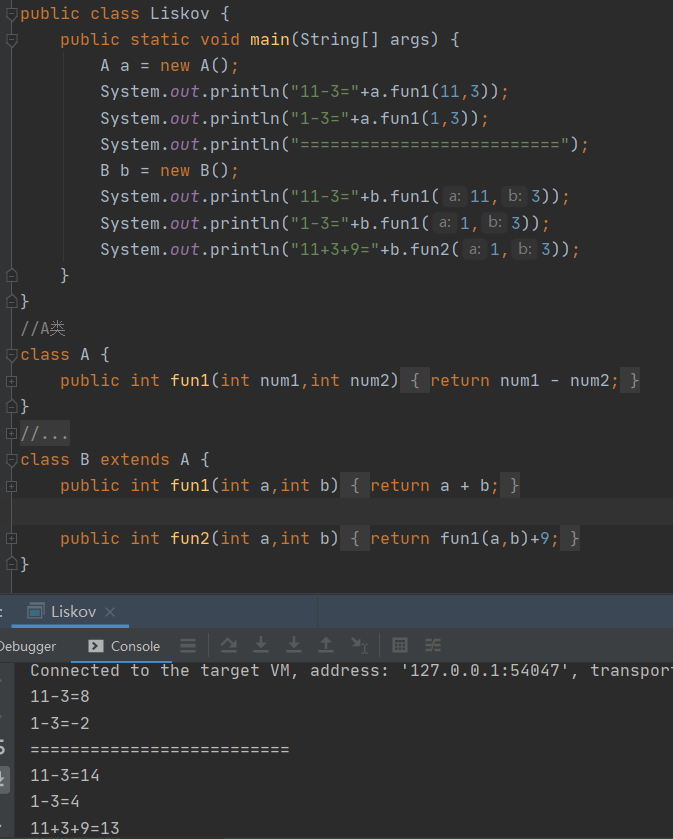

# 设计模式七大原则

## 设计模式的目的

在写代码的时候我们，常常会面临着代码的耦合性、内聚性、可维护性、重用性、灵活性等多方面的挑战，设计模式就是为了让程序，具有更加好的

1. 代码重用性（相同功能的代码，不用多次编写）
2. 可读性（编程规范性，便于其他程序员的阅读和理解）
3. 可扩展性（需要添加新功能时，十分方便）
4. 可靠性（增加新功能后，对原有的功能不影响）
5. 使程序呈现高内聚，低耦合的特性（各功能体现出来高内聚，但是相互不影响）

## 设计模式七大原则

### 单一职责原则

#### 基本介绍

相对类来说的，即一个类应该只负责一个职责，典型的例子平时我们写Web项目时比如一个UserDao这个DAO它只负责对User增删改查，这就是单一职责，假如编写了一个Dao它又操作了user表，又操作了order表，那么这个DAO就违法了单一职责原则，因为在一个类中它存在了多种职责，这可能会导致比如修改user中的需求会导致order的功能执行错误，正确的做法是将来Dao拆分成UserDao和OrderDao，确保类的单一职责

#### 案例分析

需求：编写一个交通工具类接受不同的交通工具(汽车、飞机、轮船)，输出相应的语句

##### 方案1

在方案1中我们可以看到run方法中，违法了单一职责原则，试想如果突然某一天我们汽车需求需要修改，如果我们修改不注意会导致飞机、轮船等原有的功能都出现问题

**改进：**方案2拆分出多个类每一个类负责一个职责

##### 方案2

方案2遵守了单一职责原则，一个类一个职责，但是这样做改动会很大，在我们每添加一种交通工具需要新增一个类，并且main也要new需要的类执行相应的方法，因为我们当前的业务逻辑还比较简单所以可以对单一职责原则进行化简

**改进：**方案3，直接修改Vechicle类，改动的代码会比较少

##### 方案3

方案3没有完全遵守单一职责原则，但是在方法级别上是遵守了单一职责原则，这样的改动只需有新的类型后增加新的方法即可，但是使用这种方案前提**类中方法数量足够少，才可以在方法级别保存单一职责原则**，如果你每一个交通工具类型中存在很多的方法，那你需要使用方案2完全遵守单一职责原则，这样更加的便于你代码的维护阅读

#### 单一职责原则注意事项和细节

1. 减低类的复杂的，一个类只负责一项职责
2. 提高类的可读性，可维护性
3. 降低变更代码引起的奉献
4. 通常情况下，**我们应该遵守单一职责原则**，只有逻辑足够简单，才可以在代码级违法单一职责原则；只有类中方法数量足够少，可以在方法级别保存单一职责原则

### 接口隔离原则

#### 基本介绍

1. 客户端不应该依赖他不需要的接口，即一个类对另一个类的依赖应该建立在最小接口上

#### 案例分析

编写一个接口Interface，以及4个类，B类和D类实现了Interface接口，A类需通过Interface调用B类中的方法，只需调用1，2，3方法即可，C类需通过Interface调用B类中的方法，只需调用1，4，5方法即可

##### 方案1

简单粗暴的方法，不遵循接口隔离原则，最快的方法实现

编写一个B类实现Interface1接口，实现所有方法

编写一个D类实现Interface1接口，实现所有方法

编写一个A类通过Interface1分别调用1，2，3方法

编写一个A类通过Interface1分别调用1，4，5方法

方案1简单粗暴，没有遵循接口隔离原则，B类和D类实现了Interface1中的所有方法，B类的4，5方法和D类的2，3方法是不需要实现的，因为A类和C类根本就不会调用，这种写法导致我们的B类和D类实现了很多根本无需要，并且没用的方法，也会

##### 方案2

遵循接口隔离原则，将Interface分未3个，B类实现Interface1和Interface2，D类实现Interface1和Interface3

编写Interface1只需实现1方法，编写Interface2只需实现2，3方法，编写Interface3只需实现4，5方法

编写B类实现Interface1和Interface2，实现1，2，3方法

编写D类实现Interface1和Interface2，实现1，4，5方法

编写A类通过Interface1和Interface2依赖B类的 1，2，3方法

编写C类通过Interface1和Interface3依赖B类的 1，4，5方法

方案2完全遵循了接口隔离原则来设计了该需求，把接口和方法隔离开，B类只需实现1，2，3方法无需实现4，5方法，D类只需实现1，4，5方法无需实现2，3方法

### 依赖倒转原则

####  基本介绍

1. 高层模块不应该依赖底层模块，二者应该依赖一个抽象
2. 抽象不应该依赖细节，细节应该依赖抽象
3. 依赖倒置的中心思想就是面向接口编程
4. 依赖倒置原则是基于这样的设计理念，相对于细节的多变性，抽象的对象要稳定的多，所以以抽象为基础搭建的架构比以细节为基础搭建的稳定的多，再之后的设计模式的中我们会看到设计模式，的顶层类都是抽象类或接口，充分体现了依赖倒转原则
5. 使用接口或抽象类的目的是**制定好规范**，而不涉及任何具体的操作，把细节的任务交给实现类去完成

#### 案例分析

编写一个Person类他有一个接受消息的功能

##### 方案1

方案1，最容易想到也是最简单的方法，我们只需要编写一个Email类和WeiXin类，再Person中写2个receive方法分别接受不同的消息类会调用对应类的getInfo方法，这就存在了一个问题，我们可以发现Person类依赖了Email和WeiXin类，那如果我有的短信消息需要接受，那我们是不是又要编写一个类，并且让我的Person中又要加一个方法，显然这是一件麻烦事情

##### 方案2

方案2，依赖倒转原则使用依赖倒置原则，我们只需要编写一个Ireceive接口，需要接受什么消息的对象就编写一个对象实现Ireceive接口，重写getInfo方法即可，Person只需要编写一个receive方法接受一个Ireceive对象，再main方法中调用person的receive方法你给我什么对象就会调用相应的方法，Person依赖的是一个Ireceive接口，Email和WeiXin对象依赖的也是Ireceive接口

#### 实现依赖传递的方式

##### 方式1

##### 方式2

##### 方式3

### 里氏替换原则

#### 基本介绍

1. 继承含义，父类实现的方法，实际上是在设定规范，虽然它不强制要求所有子类遵循这些规范，但是如果子类对这些已实现的方法任意修改，会对整个继承体造成破坏
2. 继承在程序设计中带来便利同时，也带来弊端，比如使用继承会给程序带来侵入性，程序可移植性降低，增加对象之间的耦合性，如果一个类被其他的类所继承，则如果这个类需要修改是，必须考虑到所以的子类，并且父类修改后，所有涉及到子类的功能都可能出现故障
3. 里氏替换原则目的就是，所有引用基类的方法必须能透明的使用其子类对象，怎么做到透明的时候，子类中尽量不要重写父类的方法这样子，那父类的方法不就对每一个子类都是透明的了吗
4. 继承实现上是把类的耦合性提高了，如果需要修改基类方法可以通过聚合，组合，依赖，来解决

在编程中如何正确的使用继承？ ==> 里氏替换原则

#### 案例分析

##### 方案1

方案1中我们可以看到，B类继承了A类，但是B来在编写代码时可能会无意识的重写了父类的方法，这样会导致一个问题，编写B类的人以为fun1方法并没有没重写，最后执行时以为fun1调用的是A类的方法，其实并不是在被编写的时候已经不小心重写了，B类入侵了A类的方法

##### 方案2

使用里氏替换原则，将A和B类同时继承一个更加继承的基类Base，A类和B类同时继承Base，那么如果B类中还想调用A类的方法，那我们可以使用组合的方式，在B类中new一个A类，编写一个fun3方法用于调用A类的fun1方法，这样就减少了A类和B类的耦合性，入侵性

### 开闭原则

#### 基本介绍

1. 开闭原则是编程中最基础，最重要的设计原则
2. 一个软件实体如类，模块和函数应该对扩展开发（对提供方），对修改关闭（对使用方），用抽象构建框架，用实现扩展细节
3. 当软件需要变化时，我们需要尽量的通过扩展的方式来实现变化，而不是通过修改原来的代码来实现变化
4. 编程中遵循其他原则，以及使用设计模式的目的就是遵循开闭原则

#### 案例分析

编写1个GraphicEditor类接受不同的类型，画出相应的图像

##### 方案1

方案1，是最简单的方法，可以看到在GraphicEditor使用了一大批if else来判断我们需要画的图像，比如现在我需要增加一个三角形，那么我不仅需要修改提供方(创建一个三角形类继承Shape)还需要修改使用方(给GraphicEditor添加新的if语句)

##### 方案2

方案1，遵循了开闭原则，我们只需要修改提供方代码即可，添加一个三角形类继承Shape使用方代码无需修改

### 迪米特法则

#### 基本介绍

1. 一个对象应该对其他对象保存最小的了解
2. 类与类关系越密切，耦合度越大
3. 迪米特法则又叫最小知道原则，即一个类对自己依赖的类知道的越少越好，也就是说，对于被依赖的类不管多么复杂，都尽量将逻辑封装在类的内部，对外只提供一个public方法
4. 迪米特法则最简单的定于：只与直接朋友通信，直接朋友:每一个对象都会与其他对象有耦合关系，只要两个对象之间有耦合关系，我们就说这两个对象之间是朋友关系，耦合的方式很多，依赖、关联、组合、聚合等，其中，我们称出现成员变量，方法参数，方法返回值中的类为直接的朋友，而出现在局部变量中的类不是直接朋友，也就是说，陌生的类最好不要以局部变量的形式出现在类的内部

#### 案例分析

编写Employee和CollegeEmployee，CollegeManger类中有一个getAllEmployee获取所有的学院员工信息，SchoolManger有一个getAllEmployee方法获取所有学院总部员工信息，也有printAllEmployee可以输出打印需要员工信息和学院总部员工信息

##### 方案1

编写一个Employee和CollegeEmployee的POJO类

编写一个CollegeManger的getAllEmployee获取学院员工，编写一个SchoolManger的getAllEmployee获取学院总部员工，以及编写一个printAllEmployee打印整个学校的员工

我们看看这个SchoolManger编写存在什么问题，我们发现这个类没有遵守迪米特法则，CollegeEmployee对象与是SchoolManger的陌生关系，因为它只是getAllEmployee方法中的一个局部变量，CollegeEmployee的遍历应该回到他自己的CollegeManger对象中完成

##### 方案2

遵守迪米特法则，把CollegeEmployee移动到CollegeManger中在SchoolManger中只需要通过sub.printEmployee();即可打印

### 合成复用原则

#### 基本介绍

1. 尽量使用合成/聚合的方式，而不是使用继承