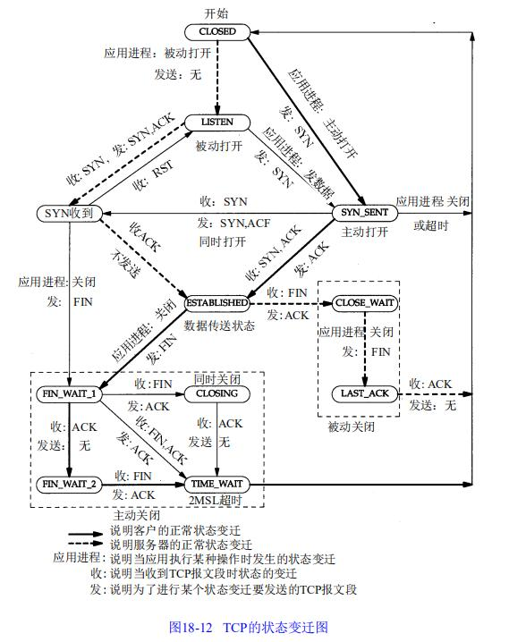

# 线上调优排查常用命令

## TCP/IP相关

~~~shell
#查看当前所有TCP连接数
netstat -nat | awk '{print $6}' | sort | uniq -c | sort -rn
#查看指定端口号tcp连接数
netstat -nat | grep 端口号 | wc -l
~~~

> 常⽤的三个状态是：ESTABLISHED+表⽰正在通信，TIME_WAIT+

## JAVA进程相关

~~~shell
#查看指定进程中开启的所有线程
ps -T -p 进程ID
#查看动态查看指定进程中线程资源使用情况
top -H -p 进程ID
#查看堆栈信息
jstack -l 进程ID     
jstack -l 进程ID > $(date +"%Y-%m-%d_%H-%M-%S").jstack.log #将内容保存到文件
#间隔1000ms采样GC信息   
jstat -gcutil 进程ID 1000
#打印jvm heap的情况
jmap -heap 进程ID
#打印jvm heap的直方图。其输出信息包括类名，对象数量，对象占用大小
jmap -histo 进程ID
#同上，但是只打印存活对象的情况
jmap -histo:live 进程ID    
~~~

## Redis相关

~~~shell
#连接指定redis
redis-cli -h IP地址 -p 端口 -a "密码" -c
#Redis大Key排查
redis-cli -h IP地址 -p 端口 -a "密码" -c --bigkeys
#查看redis信息
INFO
#多次刷新查看 rdb_changes_since_last_save 增长速度，备份频率过高需要修改rdb备份参数
#查看aof_enabled是否开启aop持久化
#需要打开混合持久化，rdb持久化会阻塞redis
INFO Persistence
#instantaneous_ops_per_sec 查看当前 OPS
INFO Stats
#connected_clients当前客户端连接数
#blocked_clients当前阻塞的客户端
INFO Clients
~~~

## Mysql相关

~~~sql
#查询所有线程
SHOW FULL PROCESSLIST;
#查询库中所有表的信息
SHOW TABLE STATUS;
#查询INNODB的信息
SHOW INNODB STATUS;
#查询全局状态(注意Thread_*参数的变化)
SHOW GLOBAL STATUS;
SHOW GLOBAL STATUS WHERE Variable_name LIKE 'Threads_%' OR Variable_name LIKE 'Que%';
~~~

~~~shell
#持续打印 Queries(每秒查询数) Threads_connected(连接数) Threads_running(正在执行线程数)
mysqladmin -hlocalhost -uroot -p'123456' ext -i1 | awk '
/Queries/{q=$4-qp;qp=$4}
/Threads_connected/{tc=$4}
/Threads_running/{printf "%5d %5d %5d\n", q, tc, $4}'
#查询mysql，线程状态统计
mysql -hlocalhost -uroot -p'123456' -e 'SHOW PROCESSLIST\G' | grep State: | sort | uniq -c | sort -rn
~~~

### 慢查询

~~~sql
#查看慢查询日志配置
show variables like 'slow_query%';
~~~

### 死锁

~~~sql
#查看死锁
SHOW ENGINE INNODB STATUS;
#查询是否有锁表
show OPEN TABLES where In_use > 0;
#查询真正死锁的线程
SELECT r.trx_id                                                     As waiting_trx_id,
       r.trx_mysql_thread_id                                        As waiting_thread,
       TIMESTAMPDIFF(SECOND, r.trx_wait_started, CURRENT_TIMESTAMP) As wait_time,
       r.trx_query                                                  As waiting_query,
       l.lock_data                                                  AS waiting_table_lock,
       b.trx_id                                                     As blocking_trx_id,
       b.trx_mysql_thread_id                                        As blocking_thread,
       SUBSTRING(p.host, 1, INSTR(p.host, '') - 1)                  As blocking_host,
       SUBSTRING(p.host, INSTR(p.host, ':') + 1)                    As blocking_port,
       r.trx_query                                                  As waiting_query,
       IF(p.command = 'Sleep', p.time, 0)                           As idle_in_trx,
       b.trx_query                                                  AS blocking_query
FROM INFORMATION_SCHEMA.INNODB_LOCK_WAITS w
         INNER JOIN INFORMATION_SCHEMA.INNODB_TRX b ON b.trx_id = w.blocking_trx_id
         INNER JOIN INFORMATION_SCHEMA.INNODB_TRX AS r ON r.trx_id = w.requesting_trx_id
         INNER JOIN INFORMATION_SCHEMA.INNODB_LocKs AS l ON w.requested_lock_id = l.lock_id
         LEFT JOIN INFORMATION_SCHEMA.PROCESSLIST As p oN p.id = b.trx_mysql_thread_id
ORDER BY wait_time DESC;

SELECT CONCAT('thread ', b.trx_mysql_thread_id, ' from ', p.host) As who_blocks,
       MAx(TIMESTAMPDIFF(SECOND, r.trx_wait_started, NOW()))      As max_wait_time,
       COUNT(*)                                                   AS num_waiters
FROM INFORMATION_SCHEMA.INNODB_LOCK_WAITS w
INNER JOIN INFORMATION_SCHEMA.INNODB_TRX b ON b.trx_id = w.blocking_trx_id
INNER JOIN INFORMATION_SCHEMA.INNODB_TRX r ON r.trx_id = w.requesting_trx_id
LEFT JOIN INFORMATION_SCHEMA.PROCESSLIST As p oN p.id= b.trx_mysql_thread_id
GROUP BY who_blocks
ORDER BY num_waiters
DESC
~~~

### 分析工具

#### pt-query-digest

**安装**

~~~shell
#必要依赖
yum install -y perl-Digest-MD5 perl-CPAN perl-Time-HiRes
#获取源码包
wget percona.com/get/percona-toolkit.tar.gz
#解压并且安装
tar zxf percona-toolkit.tar.gz
cd percona-toolkit-2.2.19
perl Makefile.PL PREFIX=/usr/local/percona-toolkit #安装路径配置
make && make install
~~~

**使用**

~~~shell
#分析指定文件
./bin/pt-query-digest data/slow.sql > $(pwd)/data/slow_report.sql
~~~

**日志说明**

[官方文档https://www.percona.com/doc/percona-toolkit/LATEST/pt-query-digest.html#attributes-reference)

~~~shell
#第一部分
Column        Meaning
============  ==========================================================
Rank          排名
Query ID      查询的ID
Response time 总响应时间和占总响应时间的百分比
Calls         此查询执行的次数
R/Call        每次执行的平均响应时间
V/M           响应时间的方差与均值比（越高表示离散度高sql有问题）
Item          提炼的查询
#第二部分
Column        Meaning
============  ==========================================================
pct           查询占当前文件的比例
total         总查询次数
min           最小值
max           最大值
avg           平均值
95%           95百分位
stddev        标准偏差
median        中位数
#第三部分，体现sql查询耗时占比
 Query_time distribution
   1us
  10us
 100us
   1ms
  10ms  #####
 100ms  ####################
    1s  ##########
  10s+
~~~

