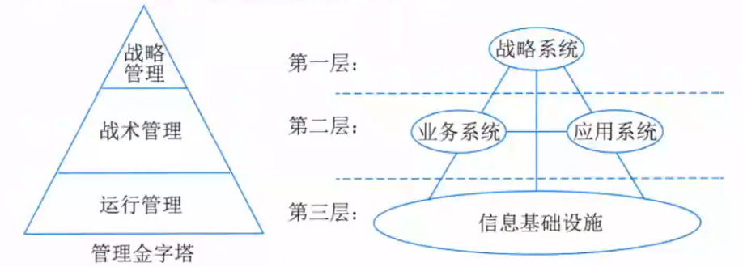
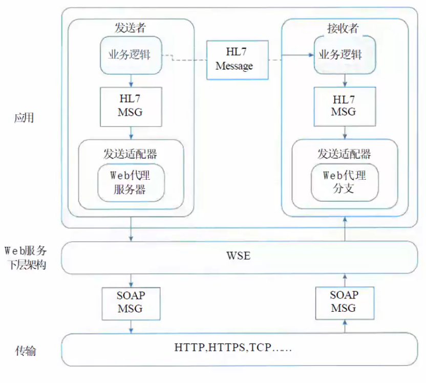

# 案例题目

## 信息系统架构设计

### 基本概念

信息系统架构（ISA）是对某一特定内容里的信息进行统筹、规划、设计、安排等一系列的有机处理的活动。特点如下

1. 架构是对系统的抽象，它通过描述元素、元素的外部可见属性及元素之间的关系来反映这种抽象，因此仅与内部具体实现有关的细节是下属于架构的，即定义强调元素的“外部可见”属性
2. 架构由多个结构组成，结构是从功能角度来描述元素之间的关系的，具体的结构传达了架构某方面的信息，但是个别结构一般不能代表大型信息系统结构
3. 任何软件都存在架构，但不一定有对该架构的具体表述文档，那架构可以独立于架构的描述而存在。如文档已过时，则该文档不能反映架构
4. 元素及行为的集合构成架构的内容，体系系统由那些元素组成，这些元素各有那些功能（外部可见），以及这些元素间如何连接于互动。
5. 架构具有“基础”性，它通常涉及解决各类关键重复问题的通用方案（复用性），以及系统设计种影响深远（架构敏感）的各项重要决策（一旦贯彻，更改的代价昂贵）
6. 架构隐含有“决策”，即架构是由架构设计师根据关键的功能和非功能性需求（质量属性及项目相关的约束）进行设计与决策的结果

### 架构分类

信息系架构可分为物理结构与逻辑结构，物理结构是指不考虑系统各部分的实际工作与功能结构，只抽象的考察其硬件系统的空间发布情况，逻辑结构是指系统各功能子系统的综合体。

物理结构一般分为集中式与分布式两大类

逻辑结构在信息系统开发中，强调对各种子系统进行统一规划，并对子系统进行综合

1. 横向综合：将同一管理层次的各种职能综合在一起，例如将运行控制层的人事和工资子系统综合在一起，使基层业务处理一体化
2. 纵向综合：把某种职能的各个管理层的业务组织在一起，这种综合沟通了上下级的联系，如工厂的会计系统和公司会计系统综合在一起，它们都有共同之处，能形成一体化的处理过程
3. 纵横综合：主要是从信息模型和处理模型两个方面来进行综合，做到信息集中共享，程序尽量模块化，注意提取通过部分，建立系统公用数据库和统一的信息处理系统

信息系统常用四种架构模型

1. 单机应用模式：是最简单的软件结构，是指运行在物理机器上的独立应用程序。单机系统本身也可以很复杂
2. 客户机/服务器模式：即两层、三层C/S、B/S模式、MVC模式等
3. 面向服务的架构（SOA）模式
4. 企业数据交换总线：不同企业应用之间进行信息交换的公共通道

### 企业信息系统总体框架

要在企业中建立一个有效集成的ISA，必须考虑企业中的四个方面：战略系统、业务系统、应用系统和信息基础设施

* 战略系统：是在企业中与战略指定、高层决策有关的管理活动和计算机辅助系统

  > 在ISA中战略系统由两个部分组成，其一是以计算机为基础的高层决策支持系统，其二是企业的战略规划体系
  >
  > 在ISA中设立战略系统有两重含义，一是它表示信息系统对企业高层管理者的决策支持能力；二是它表示企业战略规划对信息系统建设的影响和要求

* 业务系统：企业中完成一定业务功能的各部分（物质、能量、信息和人）组成的系统

  > 作用：对企业现有业务系统、业务过程和业务活动进行建模，并在企业战略的指导下，采用业务流程重组（BPR）的原理和方法进行业务过程优化重组

* 应用系统：即应用软件系统，指信息系统中的应用软件部分。如TPS、MIS、DSS等

  > 两个基本组成部分：内部功能实现部分和外部界面部分

* 企业信息基础设施：是指根据企业当前业务和可预见的发展趋势，及对信息采集、处理、存储和流通的要求，构筑由信息设备、通信网络、数据库、系统软件和支持性软件等组成的环境。

  > 这里可以将企业信息基础设施分成三部分：技术基础设施、信息资源设施和管理基础设施
  >
  > 1. 技术基础设施：由计算机、网络、系统软件、支持性软件、数据交换协议等组成
  > 2. 信息资源设施：数据与信息本身、数据交换的形式与标准、信息处理方法等组成
  > 3. 管理基础设施：企业中信息系统部门的组织结构、信息资源设施管理人员的分工、企业信息基础设施的管理办法与规章制度等

### 开放式企业框架标准

开放式企业框架标准（TOGAF），它是为标准、方法论和企业架构专业人员之间沟通提供一致性保障

该框架通过下面四个目标帮助企业组织和解决所有关键业务需求：

1. 确保从关键利益相关方到团队成员的所有用户都使用相同的语言
2. 避免被“锁定”到企业架构的专有解决方案
3. 节省时间和金钱更有效地利用资源
4. 实现客观的投资回报

TOGAF框架核心思想：模块化架构、内容框架、扩展指南、架构风格

TOGAF的关键是架构开发方法（ADM），为开发企业架构所需要执行各个步骤以及它们之间的关系进行详细的定义

> ADM方法是由一组按照架构领域的架构开发顺序排列成一个环的多个阶段所构成
>
> ADM三个级别的迭代：基于ADM整体的迭代、多个开发阶段间的迭代、在一个阶段内部的迭代

**ADM的全生命周期主要活动如下**

| ADM阶段                                                      | ADM阶段内的活动                                              |
| ------------------------------------------------------------ | ------------------------------------------------------------ |
| 准备阶段                                                     | 为实施成功的企业架构项目做好准备，包括定义组织机构、特定的架构框架、架构原则和工具 |
| 需求管理                                                     | 完成需求的识别、保管和交付，相关联的ADM阶段则按优先级顺序对需求进行处理 TOGAF项目的每个阶段，都是建立在业务需求之上并且需要对需求进行确认 |
| 阶段A（架构愿景）                                            | 设置TOGAF项目的范围、约束和期望。创建架构愿景，包括如下： 1.定义利益相关者； 2.确认业务上下文环境； 3.创建架构工资说明书； 4.取得上级批准； |
| 阶段B（业务架构） 阶段C（消息系统架构应用 & 数据） 阶段D（技术架构） | 从业务、信息系统和技术三个层面进行架构开发，在每一个层面分别完成以下活动： 1.开发基线结构描述； 2.开发目标架构描述； 3.执行差距分析 |
| 阶段E（机会和解决方案）                                      | 进行初步实施规划，并确认在前面阶段中确定的各种构建块的交付物形式： 1.确定主要实施项目； 2.对项目分组并纳入过度架构； 3.决定途径（制造/购买/重用、外包、商用、开源）； 4.评估优先顺序； 5.识别相依性 |
| 阶段F（迁移规划）                                            | 对阶段E确定的项目进行绩效分析和风险评估，制订一个详细的实施和迁移计划 |
| 阶段G（实施治理）                                            | 定义实施项目的架构限制： 1.提供实施项目的架构监督； 2.发布实施项目的架构合同； 3.监测实施项目以确保符合架构要求 |
| 阶段H（架构变更管理）                                        | 提供持续监测和变更管理的流程，以确保架构可以响应企业的需求并且将架构对于业务的价值最大化 |

### 信息化总体架构方法

实现信息化就要公租和完善6个要素（开发利用信息资源，建设国家信息网络，推荐信息技术应用，发展信息技术和产业，培育信息化人才，指定和完善信息化政策）的国家信息化体系

完善的信息化内涵包括四方面内容：信息网络体系、信息产业基础、社会运行环境、效用积累过程

信息化建设：指利用现代信息技术来支撑品牌管理的手段和过程。信息化建设包括了企业规模，企业在电话通信、网站、电子商务方面的投入情况，在客户资源管理、质量管理体系方面建设成就等

信息化主要体系已下6种特征：易用性；健壮性；平台化、灵活性、扩展性；安全性；门户化、整合性；移动性

信息化架构两种模式：数据导向架构，流程导向架构。

> 对于数据导向架构重点是在数据中心，BI商业智能等建设中使用较多，关注数据模型和数据质量；对流程导向架构，SOA本身是关键方法和技术，关注端到端流程整合，以及架构对流程变化的适应度。两种架构并且没有一个的边界，而是相互配合和补充
>
> * 数据导向架构研究的是数据对象和数据对象之间的关系，这个是首要的内容。在这个完成后仍然要开始考虑数据的产生、变更、废弃等数据生命周期，这些自然涉及的数据管理相关流程
> * 流程导向架构关注的是流程，架构本身目的是为了端到端流程整合服务。因此研究切入点会是价值链分析，流程分析和分解，业务组件划分

### 信息系统的生命周期阶段

| 阶段               | 工作                                                         | 输出                                       |
| ------------------ | ------------------------------------------------------------ | ------------------------------------------ |
| 系统规划阶段       | 对组织的环境、目标及现行系统的状况进行初步调查，根据组织目标和发展战略确定信息系统的发展战略，对建设新系统的需求做出分析和预测，同时考虑建设新系统所受的各种约束，研究建设新系统的必要性和可行性。根据需要与可能，给出制建系统的备选方案 | 可行性研究报告、系统设计任务书             |
| 系统分析阶段       | 根据系统设计任务书所确定的范围，对现行系统进行详细调查，描述现行系统的业务流程，指出现行系统的局限性和不足之处，确定新系统的基本目标和逻辑功能要求，即提出新系统的逻辑模型。系统分析阶段称为逻辑设计阶段。这个阶段是整个系统建设的关键阶段，也是信息系统建设与一般项目的重要区别所在 | 系统说明书                                 |
| 系统设计阶段       | 系统分析阶段的任务是回答系统“做什么”的问题，而系统设计阶段回答的问题是“怎么做”。该阶段的任务是根据系统说明书规定的功能要求了，具体设计实现逻辑模型的技术方案，也就是设计新系统的物理模型。这个阶段又称为物理设计阶段，可分为总体设计（概要设计）和详细设计两个子阶段 | 系统设计说明书（概要设计、详细设计说明书） |
| 系统实施阶段       | 将设计的系统付诸于实施的阶段，这一阶段的任务包括计算机等设备的购置、安装和调试、持续的编写和调试、人员培训、数据文件交换、系统调试与转换等 | 实施进展报告、系统测试分析报告             |
| 系统运行和维护阶段 | 系统投入运行后，需要经常进行维护和评价，记录系统运行的情况，根据一定的规则对系统进行必要的修改，评价系统的工作质量和经济效益 | 维护日志、变更日志                         |

### 价值驱动的体系结构

价值模型核心的特征可以简化为三种基本形式：

> 1. 价值期望值：表示对某一特定功能的需求，包括内容（功能）、满意度（质量）和不同级别质量的实用性
> 2. 反作用力：系统部署实际环境中，实现某种价值期望的的难度，通常期望越高难度越大，即反作用力越大
> 3. 变革催化剂：表示环境中导致价值期望值发生变化的某种事件，或者是导致不同结果的限制因素，因为一个或多个限制因素使得满足一个或者多个期望值变得更加困难

优化体系结构需要权衡：重要性、程度、后果、隔离

### 信息系统架构案例分析

#### Web服务在HL7上的应用

对于给定的卫生保健领域，HL7 3.0版本说明书是基于参考消息模型的（RIM）。是一种公共的模型框架，包括病例模型、信息模型、交互模型、消息模型和实现信息说明书，可以抽象出HL7发送者/接收者内部的这两组功能：商业逻辑和Web服务适配器

#### 商业逻辑的任务

发送端：创建一种具体HL7消息类型的XML描述。将消息传送到Web服务适配器，适配器负责传送到接收应用端

接收端：“找回”由Web服务适配器接收的HL7消息，同时从接收到的XML消息哪里打开消息；验证HL7消息是否满足用来交互的商业规划和约束；核实发送应用端是否需要一个应用层的确认消息（HL7消息类型MCI）如果是那样的话，发送那个消息

#### Web适配器功能

用来处理消息的分发和确认信息

**发送端**

1. 读取接受到的HL7消息的Transmission Wrapper，以便决定如何送达Web服务基层结构上的发送容器（例如接收应用软件），从而配置SOAP
2. 基于HL7消息类型、应用配置和规则（如安全性）来准备一个SOAP消息，包括作为一个SOAP消息体部分的HL7 XML消息，这个消息被发送到Web服务基层组织
3. 把SOAP消息传递到Web服务代理，通过网络进行传输
4. 无论发送端什么时候请求，都准备接收并存储来自接收端的效应信息或是应用层的确认消息

**接收端**

1. 从Web服务站处接收SOAP消息
2. 验证接收的SOAP消息满足应用配置和一些约束条件（如安全性）
3. 或者将这些接收到的消息在内存中以永久的形式保留
4. 有选择性地从SOAP消息里打开HL7 XML消息，同时核对接收到的HL7消息是否与期望的HL7消息类型相符合
5. 验证是否任意通信层的确认信息都需要被执行，在那种情况下需要返回一个合适的消息发送到源消息发送端
6. 传递HL7消息给接收应用端

#### 以服务为中心的企业整合

某航空公司已经在几个主要的核心系统之间构建了用于信息集成的Hub，其他应用间也有不少点到点的集成，然而存在如下困难

1. 因为大部分核心应用构建在主机之上，所有Information Hub是基于主机技术开发，很难被开发系统使用
2. Information Hub对Event支持不强，被集成在系统间的事件以点到点流转为主，被集成系统间耦合性强
3. 牵扯到多个系统间的业务写作以硬编码为主，将业务活动自动化的成本高，周期长，被开发的业务活动模块重用性差

为了解决这写企业集成中的问题，该公司决定以Ramp Control系统为例探索一条以服务为中心的企业集成道路

> 在航空业中，Ramp Coordination是指飞机从降落到起飞过程中所需要进行的各种业务活动的协调过程。需要协调的业务有：检查机位环境是否安全、以及卸货、装货和补充燃料是否方便和安全等
>
> 三种类型航班：short turn around（降落后不久就起飞）、Arrival Only（降落后隔夜起飞）、Departure Only（每天第一班飞机）

每种细分航班类型的Ramp Coordination的流程都是略有不同。如此多的流程之间共享一个业务活动的集合，如此多种类型的流程都是这些业务活动的不同组装方式。以服务为中心的企业集成种流程服务就是通过将这些流程间共享的业务活动抽象为可重用的服务，并通过流程服务提供的流程编排能力将它门组成各种大同小异的流程类型，来降低流程集成成本，加快流程集成开发效率。以服务为中心的企业集成，通过服务建模过程发现这些可重用的服务，并通过流程模型将这些服务组织在一起

Ramp Coordination相关的服务模型和Ramp Coordination流程相关的有两个业务组件

1. Ramp Control 负责Ramp Control相关各种业务活动的组件
2. Flight Management负责航班相关信息的管理，包括航班日程，乘客信息等

这两个业务 组件分别输出如下服务

1. Retrieve Flight BO：由Flight Management输出，主要用于提取和航班相关的数据信息
2. Ramp Coordination：由Ramp Control输出，主要用于Ramp Coordination流程的编排
3. Check Spot：由Ramp Control输出，用于检测机位安全信息
4. Check Unloading：由Ramp Control输出，用于检查卸货状况
5. Check Loading：由Ramp Control输出，用于检查转货状况
6. Check Push Back：用Ramp Control输出，用于检查关门动作

目前，Ramp Coordintaion流程需要4种类型的外围应用交互

1. 从乘务员管理系统提取航班乘务员的信息
2. 从订票系统中提取乘客信息
3. 从机务人员管理系统中提取机务人员信息
4. 接收来自航班调度系统的航班到达事件

主要架构元素如下

1. 消息服务：Federation Service是Ramp Coordination流程中需要从已有系统中提取4类信息，在Service建模阶段这4类信息被聚合为Flight BO（Business Object），集成了Crew Info、Cockpit Info 和 Passage Info等信息
2. 企业服务总线中的事件服务：Event Service 是在检查机务环境安全（Check Spot）前，Ramp Cordiator需要被通知航班已经到达。这个业务事件由航班调度系统激发，Flight Arrival是典型事件发现服务（Event Detect Service），它通过MQ将事件传递给Message Broker，通过JMS的Pub/Sub，这个事件被分发给Check Spot
3. 流程服务
4. 企业服务总线中的传输服务：RCMS是即将新建系统，用于提供包括Ramp Coordination在内的Ramp Control的功能

## 层次式架构设计

软件层次式结构是最通用的架构，也被叫作N层架构模式。大部分的应用会分成表现层（或称为展示层）、中间层（或称为业务层）、数据访问层（或称为持久层）、数据层

### 表现层设计

通常用XML设计表现层

UIP提供了一个扩展的框架，用于简化用户界面与商业逻辑代码的分离的方法，可以用它来写复杂的用户界面导航和工作流处理，并且它能够复用在不同的场景、并可以随着应用的增加而进行扩展

使用UIP框架的应用程序把表现层分为以下几层

> User Interface Components：这个组件就是依赖的表现层，用户看到的和进行交互都是这个组件，它负责获取用户的数据并且返回结果
>
> User Interface Process Components：这个组件用于协调用户界面的各部分，使其配合后台的活动，例如导航和工作流控制，以及状态和视图的管理。用户看不到这一组件，但是这些组件为User Interface Components提供了重要的支持功能

#### 表现层动态生成设计

基于XML的界面管理技术可以实现灵活的界面配置（静态）、界面动态生成和界面定制（动态）。其思路是用XML生成配置文件及界面所需的元数据，按不同需求生成界面元素及软件界面

### 中间层设计

#### 组件设计

业务逻辑组件分为接口和实现类两个部分。接口用于定义业务逻辑组件，定义业务逻辑组件必须实现的方法是整个系统运行的核心。增加业务逻辑组件的接口，是为了提供更好的解耦，控制器无需与具体的业务逻辑组件耦合，而是面向接口编程

#### 工作流设计

工作流定义为业务流程的全部或部分自动化，在此过程中，文档、信息或任务按照一定的过程规则流转，实现组织成员间的协调工作以达到业务的整体目标。工作流参考模型见图，其中包含6给基本模块，分别是工作流执行服务、工作流程引擎、流程定义工具、客户端应用、调用应用和管理监控工具

* 接口1：过程定义导入/导出接口。这个接口的特点是转换格式和API调用，从而支持过程定义信息间的相互交换
* 接口2：客户端应用程序接口。通过这该接口工作流可以与任务表处理器交互，代表用户资源来组织任务。然后由任务表处理器负责，从任务表中选择、推进任务项目。由任务表处理器或者终端用户来控制应用工具的活动
* 接口3：应用程序调用接口。允许工作流直接激活一个应用工具，来执行一个活动。典型的是调用以后台服务为主的应用程序，没有用户接口。当执行活动要用到的工具，需要与终端用户交互，通常是使用客户端应用程序接口来调用那个工具，这样可以为用户安排任务时间表提供更多的灵活性
* 接口4：工作流机协作接口。其目标是定义相关标准，以使不同开发商的工作流系统磁盘相互间能进行无缝的任务项传递
* 接口5：管理和监视接口。提供的功能包括用户管理、角色管理、审查管理、资源控制、过程管理和过程状态处理器等

#### 实体设计

业务逻辑层实体提供对业务数据及相关功能的状态编程访问。业务逻辑层实体可以使用具有复杂架构的数据来构建，这种数据通常来自数据库中的多个相关表

在应用程序中表示业务逻辑层实体的方法有很多，如XML、通用DataSet、有类型的DataSet等

如下左图是业务实体XML表示，右图所示为用于Order业务逻辑层实体的通用DataSet对象。此DataSet对象具有两个DataTable对象，分别保存订单详细信息。每个DataTable具有一个对应的UniqueConstraint对象，用于标识表中的主键。此外该DataSet还有一个Relation对象，用于将订单详细信息与订单相关联

#### 业务框架

业务框架位于系统架构中间层，是实现系统功能的核心组件。采用容器的形式，便于系统功能的开发、代码重用和管理。下图便是在吸收了SOA思想之后的一个三层体系结构的简图

业务层采用业务容器的方式存在于整个系统当中，采用此方式可以大大降低业务层和相邻各层的耦合，表示层代码只需要将业务参数传递给业务容器，而不需要业务层多余的干预。如此一来，可以有效地防止业务层代码渗透到表示层

在业务容器中，业务逻辑是按照Domain Model -- Service -- Control 实现来实现的

1. Domain Model：是领域业务对象，它仅仅包含业务相关的属性
2. Service：是业务过程实现的组成部分，是应用程序的不同功能单元，通过在这些服务之间定义良好的接口和契约联系起来
3. Control：服务控制器，是服务之间的纽带，不同服务之间的切换就是通过它来实现的

### 数据访问层设计

#### 5种数据访问模式

1. 在线访问：会占用一个数据库连接，读取数据，每个数据库操作都会通过这个连接不断地于后台的数据源进行交互
2. DataAccess Object（Dao）：是标准J2EE设计模式之一，开发人员常常用这种模式将底层数据访问操作于高层业务逻辑分离开
3. Data Transfer Object（DTO）：是经典的EJB设计模式之一。DTO本身是这样一组对象或是数据的容器，它需要跨不同的进程或是网络的边界来传输数据。这类对象本身应该不包含具体的业务逻辑，并且通常这些对象内部只能进行一些诸如内部一致性检查和基本验证之类的方法，而且这些方法最好不要再调用其他的对象行为
4. 离线数据模式：是以数据为中心，数据从数据源获取之后，将按照某种预定的结构存放在系统种，成为应用的中心。离线，对数据的各种操作独立于各种于后台数据源之间的连接或是事务
5. 对象/关系映射（Object/Relation Mapping，O/R Mapping）：简称ORM，大多数应用中的数据都是依据关系模型存储在关系数据库中；而很多应用程序中的数据在开发或是运行时则是以对象的形式组织起来的。那么，对象/关系映射就提供了这样一种工具或是平台，能够帮助将应用程序中的数据转换成关系数据库中的记录；或是将关系数据库中的记录转换成应用程序中代码便于操作的对象

#### 工厂模式在数据访问层的应用

首先定义一个操纵数据库的接口DataAccess，然后工具数据库的不同，由类工厂实例化对应的类

因为DataAccess的具体实现类有一些共同的方法，所以先从DataAccess实现一个抽象的AbstracDataAccess类，包含一些公用方法。然后分别为SQL Server、Oracle和OleDb数据库编写三个数据访问的具体实现

选择已完成了所要的功能，下面需要创建一个Factory类，来实现自动数据库切换的管理。这个类很简单，主要功能就是根据数据库类型，返回适当的数据库操作类

#### 事务处理设计

JavaBean中使用JDBC方式进行事务处理：在JDBC中，打开一个连接对象Connecton时，默认是auto-commit模式，每个SQL语句被当作一个事务，即每次执行一个语句，都会自动地得到事务确认。为了能够将多个SQL语句组合成一个事务，要将auto-commit模式屏蔽掉。在auto-commit模式屏蔽之后，如果不调用commit()方法，SQL语句不会得到事务确认。在最近一次commit()方法调用之后所有SQL会在方法commit()调用时得到确认

#### 连接对象的管理设计

通过资源池解决资源频繁分配、释放造成的问题

建立连接池的第一步，就是建立一个静态的连接池。所谓静态，是指池中的连接是在系统初始化时就分配号的，并且不能够随意关闭。Java中给我们提供了很多容器类，可以方便地用来构建连接池，如Vector、Stack等。在系统初始化时，根据配置创建连接并放置在连接池中，以后所使用的连接都是从该连接池中获取的，这样就可以避免连接随意建立、关闭造成的开销

有了这个连接池，下面就可以提供一套自定义的分配、释放资源策略。当客户请求数据库连接时，首先看连接池中是否有未分配出去的连接。如果存在空闲连接则把连接分配给客户，并标记连接已分配。若连接池中没有空闲连接，就在已分配出去的连接中，寻找一个合适的连接给客户，此时该连接在多个客户间复用

当客户释放数据库连接时，可以根据该连接是否被复用，进行不同的处理。如果连接没有使用者，就放入到连接池中，而不是被关闭

### 数据架构的规划与设计（数据层）

#### 数据库设计与XML设计融合

XML文档分为两类：一类是以数据为中心的文档，这种文档的结构上是规则的，在内容上是同构的，具有较小的混合内容和嵌套层次，人们只关心文档中的数据而并不关心数据元素的存放顺序，这种文档简称为数据文档，它常用来存储和传输Web数据。另一类是以文档为中心的文档，这种文档的结构不规则，内容比较零散，具有较多的混合内容，并且元素之间的顺序是有关的，这种文档常用来在网页上发布描述信息、产品性能介绍和E-mail信息等

**经提出的XML文档的存储方式有两种：基于文件的存储方式和数据库存储方式**

1. 基于文件的存储方式：基于文件存储方式是指将XML文件按其原始文本形式存储，主要存储技术包括操作系统文件库、通用文档管理系统和传统数据库的列。这种存储方式需维护某种类型的附加索引，以建立文件之间的层次结构。

   > 特点：无法获取XML文档中的结构化数据；通过附加索引可以定位具有某些关键字的XML文档，一旦关键字不确定，将很难定位；查询时只能以原始文档的形式返回，即不能获取文档内部信息；文件管理存在容量大、管理难的缺点

2. 数据库存储方式：数据库在数据管理方面具有管理方便、存储占用空间小、检索速度快、修改效率高和安全性号等优点。一种比较自然的想法是采用数据库对XML文档进行存钱操作，这样可以利用相对成熟的数据库技术处理XML文档内部的数据。

   > 特点：能够管理结构化和半结构化数据；具有管理和控制整个文档集合本身的能力；可以对文档内部的数据进行操作；具有数据库技术的特性，如多用户、并发控制和一致性约束等；管理方便，易于操作

### 物联网层次架构设计

物联网可以分三个层次，底层是用来感知数据的感知层，即利用传感器、二维码、RFID等设备随时随地的获取物体的信息。第二层是数据传输处理的网络层，即通过各种传感网络与互联网的融合，将对象当前的信息实时准确的传递出去。第三层则是与行业需求结合的应用层，即通过智能计算、云计算等将对象进行智能化控制

#### 感知层

用于识别物体、采集信息。感知层包括二维码标签和识读器、RFID标签和读写器、摄像头、GPS、传感器、M2M终端、传感器网关等，主要功能是识别对象、采集信息，与人体结构中皮肤和五官作用类型。感知层解决的是人类世界和物理世界的数据获取问题

#### 网络层

用于传递信息和处理信息。网络层包括通信网络与互联网的融合网络、网络管理中心、信息中心和智能处理中心等。网络层将感知层获取的信息进行传递和处理，类似于人体结构中的神经中枢和大脑。网络层解决的是传输和预处理感知层所获取数据的问题

#### 应用层

实现广泛智能化，应用层是物联网于行业专业技术的速度融合，结合行业需求实现行业智能化，这类似于人们的社会分工，物联网应用层利用结果分析处理的感知数据，为用户提供丰富的特定服务。应用层解决的是信息处理和人机交互的问题

### 层次式架构案例分析

#### 电子商务网站

PetShop 2.0（图13-16）中可以看到，并没有明显数据访问层设计。这样的设计虽然提高了数据访问的性能，但也同时导致了业务逻辑层于数据访问层的职责混乱

PetShop 3.0（图13-15） 纠正了此前层次不明的问题，将数据访问逻辑作为单独的一层独立出来

PetShop 4.0 （无图）基本延续了3.0的结构，但在性能上作了一定的改进，引入了缓存和异步处理机制，同时又充分利用了ASP.NET 2.0新功能MemberShip

可以看到（图13-19），在数据访问层中，完全采用了“面向接口编程”思想。抽象出来的IDAL模块，脱离了与具体数据库的依赖，从而使得整个数据访问层有利于数据库迁移。DALFactory模块专门管理DAL对象的创建，便于业务逻辑层访问。SQLServerDAL和OracleDAL模块均实现IDAL模块的接口，其中包含的逻辑就是对数据库的Select、Insert、Update、Delete操作。因为数据库类型的不同，对数据库的操作也有所不同，代码也因此有所区别

此外，抽象出来的IDAL模块，除了解除了向下的依赖之外，对于其上的业务逻辑层同样仅存在弱依赖关系，如图13-20

图13-20中，BLL是业务逻辑层的核心模块，它包含了整个系统的核心业务。在业务逻辑层中，不能直接访问数据库，而必须通过数据访问层。注意，13-20中对数据访问业务的调用是通过接口模块IDAL来完成的。与具体的数据访问逻辑无关，则层与层之间的关系是松散耦合的。如果此时需要修改数据访问层的实现，只要不涉及IDAL的接口定义，那么业务逻辑层就不会受到任何影响。毕竟，具体实现的SQLServerDAL和OracalDAL根本就与业务逻辑层没有半点关系

#### 基于物联网架构的小票系统

## 云原生架构设计

### 架构内涵

云原生架构是基于云原生技术的一组架构原则和设计模式的集合，旨在将云应用中的非业务代码部分进行最大化的剥离，从而让云设施接管应用中原有的大量非功能性（如弹性、韧性、安全、可观测性、灰度等），使业务不再有非功能性业务中断困扰的同时，具备轻量、敏捷、高度自动化的特点

云原生的代码通常包括三部分：业务代码、三方软件、处理非功能特性的代码。从业务代码中剥离大量非功能性特性（不会是所有，比如易用性还不能剥离）到IasS和PaaS中

具备云原生架构的应用可以最大程度利用云服务和提升软件交付能力，进一步加快软件开发。其特点包括：代码结构发生巨大变化、非功能性特性大量委托、高度自动化的软件交付

### 架构原则

| 原则               | 说明                                                         |
| ------------------ | ------------------------------------------------------------ |
| 服务化原则         | 拆分为微服务架构、小服务架构，分别迭代                       |
| 弹性原则           | 系统的不是规模可以随着业务量的变化而自动伸缩                 |
| 可观测原则         | 通过日志、链路跟踪和度量等手段                               |
| 韧性原则           | 当软件所依赖的软硬件组件出现各种异常时，软件表现出来的抵御能力 |
| 所有过程自动化原则 | 一方面标准化企业内部软件交付过程，另一方面在标准化的基础上进行自动化，通过配置数据自描述和面向终态的交付过程 |
| 零信任原则         | 默认情况下不应该信任网络内部和外部是任何人/设备/系统，需要基于认证和授权重构访问控制的信任基础，以身份为中心 |
| 架构持续演进原则   | 云原生架构本身也必须是一个具备持续演进能力的架构             |

### 主要架构模式

| 架构             | 说明                                                         |
| ---------------- | ------------------------------------------------------------ |
| 服务化架构模式   | 典型模式是微服务和小服务模式。通过服务化架构，把代码模块关系和部署关系进行分离，每个接口可以部署不同数量的实例，单独扩缩容，从而使得整体的部署更经济 |
| Mesh化架构模式   | 把中间件框架（如RPC、缓存、异步消息等）从业务进程中分离，让中间件SDK与业务代码进一步解耦，从而使得中间件升级对业务进程没有影响。分离后在业务进程中保留很”薄“的Client部分 |
| Serverless模式   | 将”部署“这个动作从运维中”收走“，使开发者不用关心应用运行地点、操作系统、网络配置、CPU性能等，也就是把应用的整个运行都委托给云 |
| 存储计算分离模式 | 在云环境中，推荐把各类暂态数据（如session）、结构化和非结构化持久数据都采用云服务来保存，从而实现存储计算分离 |
| 分布式事务模式   | 大颗粒度的业务需要访问多个微服务，必然带来分布式事务问题，否则数据就会出现不一致。架构师需要根据不同的场景选择合适的分布式事务模式 |
| 可观测架构       | 可观测架构包括Logging、Tracing、Metrics三个方面，其中Logging提供多个级别的详细信息跟踪，由应用开发者主动提供；Tracing提供一个请求从前端到后端的完整调用链路跟踪，对于分布式场景尤其有用；Mestrics则提供对系统量化的多维度量 |
| 事件驱动架构     | 本质上是一种应用/组件间的集成架构模式。可用于服务解耦、增强服务韧性、数据变化通知等场景中 |

### 相关技术

#### 容器技术

容器作为标准化软件单元，它将应用及其所有依赖项打包，使应用不再受环境限制，在不同计算环境间快速、可靠的运行

> 容器技术，企业可以充分发挥云计算弹性优势，降低运维成本
>
> Kubernetes已经成为容器编排的事实标准，被广泛用于自动部署，扩展和管理容器化应用。
>
> Kubernetes提供了分布式应用管理的核心能力，包括：资源调度、应用部署与管理、自动修复、服务发现于负载均衡、弹性伸缩、声明式API、可扩展性架构、可移植性

#### 云原生微服务

微服务模式将后端单体应用拆分为松耦合的多个子应用，每个子应用负责一组子功能。这些子应用称为”微服务“，多个”微服务“共同形成了一个物理独立但逻辑完整的分布式微服务体系。这些微服务相对独立，通过解耦语法、测试于部署流程，提高整体迭代效率

##### 微服务设计约束

1. 微服务个体约束：功能在业务域划分上应是相互独立的，低耦合、单一职责
2. 微服务于微服务之间的横向关系：主要从服务的可发现性和可交互性处理服务间的横向关系，一般需要服务注册中心
3. 微服务于数据层之间的纵向关系：在微服务领域，提供数据存储隔离原则，即数据是微服务的私有资产，对于数据的访问都必须通过当前微服务提供的API来访问
4. 全局视角下的微服务分布式约束：故障发现时效性和根因精确性始终是开发运维人员的核心诉求

##### 主要微服务技术

| 技术                 | 说明                                                         |
| -------------------- | ------------------------------------------------------------ |
| Apache Dubbo         | 源于阿里巴巴的一款开源高性能RPC框架，特性包括基于透明接口的RPC、智能负载均衡、自动服务注册和发现、可扩展性高、运行时流量路由于可视化的服务治理 |
| Spring Cloud         | 作为开发者的主要微服务选择之一，为开发者提供了分布式系统需要的配置管理、服务发现、断路器、智能路由、微代理、控制总线、一次性Token、全局锁、决策竞选、分布式会话于集群状态管理等能力和开发工具 |
| Eclipse MicroProfile | 作为Java微服务开发的基础编程模型，它致力于定义企业Java微服务规范，MicroProfile提供指标、API文档、运行状况检查、容错于分布式跟踪等能力，使用它创建的云原生微服务开源自由地部署在任何地方，包括服务网络架构 |
| Tars                 | 是腾讯将其内部使用的微服务框架，包括一整套开发框架于管理平台，兼顾多语言、易用性、高性能于服务治理，理念是让开发更聚焦业务逻辑，让运维更高效 |
| SOFStack             | 是由蚂蚁金服开源的一套用于快速构建金融级分布式架构的中间件，也是在金融场景里的最佳实践 |
| DAPR                 | 分布式运行时是微软推出的一种可移植性、无服务的、事件驱动的运行时，它使开发人员开源轻松构建弹性，无状态和有状态微服务，这些服务运行在云和边缘上，并包含多种语言和开发框架 |

#### 无服务器技术（Serverless）

因为屏蔽了服务器和各种运维复杂度，让开发人员开源将更多精力用于业务逻辑设计与实现，而逐渐成为云原生主流技术之一。

Serverless计算包含以下特征

1. 全托管的计算服务：客户只需要编写代码构建应用，无需关注同质化的、负担繁重的基于服务器等基础设施的开发、运维、安全、高可用等工作
2. 通用性：结合BaaSAPI的能力，能够支撑云上所有重要类型的应用
3. 自动弹性伸缩：让用户无需为资源使用提前进行容量规划
4. 按量计费：让企业使用成本得有效降低，无需为闲置资源付费

函数计算（FaaS）是Serverless中最具代表性的产品形态。通过把应用逻辑拆分多个函数，每个函数都通过事件驱动的方式触发执行

无服务器技术关注点（云厂商关注的）：计算资源弹性调度、负载均衡和流控、安全性

#### 服务网格（ServiceMesh）

服务网格（ServiceMesh）是分布式应用在微服务软件架构之上发展起来的新技术，指在将那些微服务间的连接、安全、流量控制和可观测等通用功能下沉为平台基础设施，实现应用于平台基础设置的解耦。这个解耦意味着开发者无需关注微服务相关治理问题而聚焦于业务逻辑本身，提升应用开发效率并加速业务探索和创新

在这架构图中，服务A调用服务B的所有请求，都被其下服务代理截获，代理服务A完成到服务B的服务发现、熔断、限流等策略，而这些策略的总控是在控制平面（ControlPlane）上配置

### 云原生架构案例分析

#### 某旅行公司云原生改造

面临问题：公司主题由两个公司合并，技术体系不同，需要整合为一体；节假日高并发流量

第一阶段：某旅行技术团队为了提高集群资源利用率，降低资源使用成本。利用云原生思维重构部分技术体系，将多套旧有系统合并、收拢到一套云原生应用为核心的私有云平台上，同时将IDC、物理网络、虚拟网络、技术资源、存储资源等通过IaaS、PaaS等，实现虚拟化封装、切割、再投产的自动化流程

随着服务器集群规模扩大，部分机器开始频繁出现故障。此时，保障服务稳定性成了第二阶段改造的首要任务

第二阶段：基于公有云、私有云的离线专属云集群等新型动态计算环境，某旅行公司的技术团队帮助业务构建和运行具有弹性的云原生应用，促进业务团队开始使用声明式API，同时通过不可变基础设施、服务网格和容器服务，来构建容错性号、易于管理和观察的应用系统，并结合平台可靠的自动化恢复、弹性计算来完成整个服务稳定性的提升

第三阶段：通过基础组件、服务的云原生改造、服务依赖梳理和定义等方式，使用应用不再需要考虑底层资源、机房、运行时间和供应商等因素。此外，还利用标准的云原生应用模型，实现了服务的跨地域、跨自动化灾备、自动部署、并向云原生场景下的DevOps演进

架构如如下：

#### 某汽车公司数字化转型

战略性容器云平台：通过平台实现对某App、二手车、在线支付、优惠券等核心互联网应用承载。以多租户的形式提供弹性计算、数据持久化、应用发布等面向敏捷业务服务，并实现高水平资源隔离。标准化交付部署，快速实现业务扩展，满足弹性要求。

数字混合云交付：采用私有云+公有云的混合交付模式，按照服务的敏态/稳态特性和管控要求划分部署，灵活调度公有云资源来满足临时突发或短期高TPS业务支撑的需求

深度融合微服务治理体系：实现架构的革新和能力沉淀，逐步形成支撑数字化应用的业务中台

#### 某快递公司核心业务系统云原生改造

某快递公司核心业务系统原架构基于Vmware+Oracle数据库进行搭建。随着搬迁上阿里云，架构全面转型为基于 Kubernetes的云原生架构体系

通过引入云原生数据库、应用容器化、微服务改造技术，得到如下云架构：

基础设施：全部计算资源取自阿里云的神龙服务器

流量接入：阿里云提供两套流量接入，一套是面向公网请求，另一套是服务内部调用

基于Kubernetes打造的云原生PaaS平台明显突出，每个应用都再Kubernetes上创建单独的一个Namespace，应用于应用之间实现资源隔离

现实Kubernetes集群采用阿里云托管版容器服务，免去了运维Master节点的工作，只需要定制Worker节点上线及下线流程即可

#### 某电商业务云原生改造

* 通过容器化部署，利用阿里云容器服务的快速弹性应对大促时的资源快速扩容

* 提前接入链路跟踪产品，用于对分布式下复杂服务调用进行跟踪，对异常服务进行定位，帮助客户再测试和生产中快速定位问题并修复，降低对业务的影响
* 使用阿里云性能测试服务（PTS）进行压测，利用秒级流量拉起、真实地理位置流量等功能，以最真实的互联网流量进行压测，确保业务上线后稳定运营
* 采集压测数据，解析系统强弱依赖关系，关键瓶颈点，对关键业务接口、关键第三方调用、数据库慢调用、系统整体负载等进行限流保护
* 配合阿里云服务团队，在大促前进行ECS/RDS/安全等产品扩容、链路跟踪、缓存/连接池预热、监控大屏制作、后端资源保障演练等，帮助大促平稳进行

## 面向服务架构设计

### SOA概述

在面向服务的体系结构（SOA）中，服务的概念有了延伸，泛指系统对外提供的功能集

从应用的角度定义，可以认为SOA是一种应用框架，它着眼于日常的业务应用，并将它们划分为单独的业务功能和流程，即所谓的服务。SOA使用户可以构建、部署和整合这些服务，且无需依赖应用程序及其运行平台，从而提高业务流程的灵活性

从软件的基本原理定义，可以认为SOA设施一个组件模型，它将应用程序的不同功能单元（称为服务）通过这些服务之间定义良好的接口和契约联系起来。接口是采用中立的方式进行定义的，它应该独立于实现服务的硬件平台、操作系统和编程语言

业务流程是指为了实现某种业务目的行为所进行的流程或一系列动作

BPEL：面向Web服务的业务流程执行语言，是一种使用Web服务定义的执行业务流程的语言。使用BPEL，用户可以通过结合、编排和协调Web服务自上而下地实现面向服务的体系结构。BPEL目前用于整合现有的Web Service，将现有的Web Services按照要求的业务流程整理成一个新的Web Services，在这个基础上，形成一个外界看来和单个Service一样的Service

### SOA的微服务化发展

SOA架构向更细颗粒度、更通用化程序发展，就成了所谓的微服务了

> SOA与微服务区别如下
>
> 1. 微服务相比SOA更加精细，微服务更多地以独立的进程的方式存在，相互之间并无影响
> 2. 微服务提高了接口方式更加通用化，例如HTTP RESTful方式，各种终端都可以调用，无关语言、平台限制
> 3. 微服务更倾向于分布式去中心化的部署方式，在互联网业务场景下更适合

SOA架构是一个面向服务的架构，可将视为组件模型，其将系统整体拆分为多个独立的功能模型，模块之间通过调用接口进行交互，有效整合了应用系统的各项业务功能，系统各个模块之间是松耦合的。SOA架构以企业服务总线链接各个子系统，是集中式的技术架构，应用服务之间相互依赖导致部署复杂，应用之间交互使用远程通信，降低了响应速度

微服务架构是SOA的进一步优化，去除了ESB企业服务总线，是一个真正意义上去中心化的分布式架构。其降低了微服务之间的耦合程度，不同的微服务采用不同的数据库技术，服务独立，数据源唯一，应用极易扩展和维护，同时降低了系统复杂性

### SOA参考架构

典型的以服务为中心的企业集成架构如下图所示，采用”关注点分离“的方法规划企业集中的各种架构元素，同时从服务视角规划每种架构元素提供的服务，以及服务如何被组合在一起完成某种类型的集成，可分为六大类

1. 开发服务（Development Services）：贯彻整个软件开发生命周期的开发平台
2. 业务创新和优化服务（Business Innovation and Optimization Services）：用于监控业务系统运行时服务的业务性能，采取适应变化的市场
3. 控制服务（Control Service）：包括实现人、流程和信息集成的服务，以执行这些集成逻辑的能力
4. 连接服务（Connectivity Services）：通过提供企业服务总线提供分布在各种架构元素中服务间的连接性
5. 业务逻辑服务（Business Logic Service）：包括用于实现业务逻辑的服务和执行业务逻辑的能力
6. IT服务管理（IT Services Management）：支持业务系统运行的各种基础设施管理能力或服务

#### 开发服务

开发环境和根据中为不同开发者的角色提供的功能被称为开发服务。

> 根据开发过程中开发者和职责不同，有如下4类服务：建模服务、设计服务、实现服务、测试服务

#### 业务创新和优化服务

以业务性能管理（BPM）技术为核心提供业务事件发布、收集和关键业务指标监控能力。

> 包括以下服务
>
> 1. 公共事件框架服务：通过一个公共事件框架提供IT和业务事件的激发、存储和分类等
> 2. 采集服务：通过基于策略的过滤和相关性分析检测感兴趣的服务
> 3. 监控服务：通过事件于监控上下文的映射，计算和管理业务流程的关键性能指标

#### 控制服务

* 数据整合（信息服务）：提供集成数据的能力。

  > 目前主要包括如下集中信息服务：联邦服务（不同类型数据聚合）、复制服务（远程数据本地访问）、转换服务（格式转换）、搜索服务

* 流程整合（流程服务）：完成业务流程集成。

  > 包括：编排服务（预定义流程顺序）、事务服务（保证ACID）、人工服务（人工活动集成到流程中）

* 数据访问整合（交互服务）：实现用户访问集成

  > 包括：交付服务（运行时交互框架）、体验服务、资源服务（运行时交互组件的管理）

#### 连接服务

连接服务由称为企业服务总线ESB，基本特征如下

* 描述服务的元数据和服务注册管理
* 在服务请求者和提供者之间传递数据，以及对这些数据进行转换的能力，并支持由实践中总结出来的一些模式如同步模式、异步模式等
* 发现、路由、匹配和选择的能力，以支持服务之间的动态交互，解耦服务请求者和服务提供者
* 高级一些的能力，包括对安全的支持、服务质量保证、可管理型和负载平衡等

#### 业务逻辑服务

* 整合已有应用（应用和信息服务服务）：实现对已有应用和信息的集成。

  > 主要有两类服务服务，包括：可接入服务、事件发现服务

* 整合新开发的应用（业务应用服务）：实现新应用集成，主要有三类业务应用服务

  > 包括：组件服务（可重用）、核心服务（运行时）、接口服务

* 整合客户和业务伙伴（伙伴服务）：提供于企业外部的B2B的集成能力

  > 包括：社区服务、文档服务、协议服务

#### IT服务管理

为业务流程和服务提供安全、高效和健康的运行环境

> 包括：安全和目录服务、系统管理和虚拟化服务

### SOA主要协议和规范

Web服务最基本协议包括UDDI、WSDL和SOAP，通过它们，可以提供直接而又简单的Web Service支持如图

UDDI（统一描述、发现和集成协议）：是一个广泛的、开放的行业计划。它使得商业实体能够彼此发现；定义它们怎样在Internet上相互作用，并在一个全球的注册体系架构中共享信息

WSDL（Web 服务描述语言）：是一个用来描述Web服务和说明如何与Web服务通信的XML语言。

> 可描述三个基本属性：服务做什么、如何访问服务、服务位于何处

SOAP：在分散或分布式的环境中交换信息和简单的协议，是一个基于XML的协议。

> 它包括4个部分：SOAP封装，定义了一个描述消息中的内容是说明，是谁发送的，谁应当接收并处理它以及如何处理它们的框架；SOAP编码规则，用于表示应用程序需要使用的数据类型和实例；SOAP RPC表示远程过程调用和应答协定；SOAP绑定是使用底层协议交换信息

### SOA的设计标准和原则

#### SOA设计标准要求

* 文档标准化：XML文档，Web描述语言

* 通信协议标准：用消息进行通信，消息使用XML Schema来定义

* 应用程序统一登记与集成：通过扮演目录列表角色的登记处来维护，UDDI是标准

* 服务质量（Qos）：每项SOA服务都有一个与之相关的服务质量。Qos的一些关键元素有安全需求（例如认证和授权）、可靠通信以及谁能调用服务的策略。

  > 其服务和标准包括：
  >
  > * 可靠性：”仅且仅仅传送一次“、”最多传送一次“、”重复消息过滤“ 和 ”保证消息传送“等特性消息的发送和确认
  > * 安全性：主要包括认证交换、消息完整性和消息保密
  > * 策略：服务提供者有时候会要求服务消费者与某种策略通信
  > * 控制：在SOA中，进程使用一组离散的服务创建的，BPEL4WS或者WSBPEL是用来控制这些服务的语言
  > * 管理：让系统管理员管理所有，运行在多环境下的服务和管理系统

#### SOA设计原则

| 原则                     | 说明                                                         |
| ------------------------ | ------------------------------------------------------------ |
| 无状态                   | 以避免请求者依赖于服务提供者的状态                           |
| 单一实例                 | 避免功能冗余                                                 |
| 明确定义的接口           | 使用者依赖服务规约调用服务，所以服务定义必须长时间稳定，一旦公布，不能随意更改；服务定义尽可能明确，减少使用者的不适当使用；不要让使用者看到服务内部私有数据 |
| 自包含和模块化           | 服务封装了那些在业务上稳定、重复出现的活动和组件，实现服务的功能实体是完全独立自主的，独立进行部署、版本控制、自我管理和恢复 |
| 粗粒度                   | 服务数量不应该太大，依靠消息交互而不是远程过程调用（RPC），通常消息量比较大，但是服务之间的交互频度较低 |
| 服务之间的耦合性         | 服务使用者看到的是服务的接口，其位置、实现技术和当前状态等对使用者是不可见的，服务私有数据对服务使用者是不可见的 |
| 重用能力                 | 服务应该是可以重用的                                         |
| 互操作性、兼容和策略声明 | 为了确保服务规约的全面和明确，策略成为一个越来越重要的方面。这可以是技术相关的内容，例如一个服务对安全性方面的要求；也可以是跟业务有关的语义方面的内容，例如需要满足的费用或者服务级别方面的要求，这些策略对于服务交互时是非常重要的 |

### SOA的设计模式

#### 服务注册表模式

1. 服务注册：应用开发者，也叫服务提供者，向注册表公布它们的功能
2. 服务位置：也就是服务应用开发者，帮助它们查询注册服务，寻找符合自身要求的服务
3. 服务绑定：服务的消费者利用检索到的服务合同来开发代码，开发的代码将于注册的服务绑定、调用注册的服务以及于它们实现互动

#### 企业服务总线模式

由中间件技术实现的支持面向服务架构的基础软件平台，支持异构环境中的服务以基于消息和事件驱动模式的交互，并且具有适当的服务质量和可管理性

一个典型的ESB环境中组件之间的交互过程是：首先由服务请求者触发一个交互过程，产生一个服务请求消息，并将该消息按照ESB的要求标准化，然后标准化的消息被发送给服务总线。ESB根据请求消息中的服务名或者接口名进行目的组件查找，将消息转发至目的组件，并最终将处理结果逆向返回给服务请求者。这种交互过程不再是点对点的直接交互模式，而是由事件驱动的消息交互模式。

ESB的核心功能如下：

1. 提供透明性的消息路由和寻址服务
2. 提供服务注册和命名的管理功能
3. 支持多种消息传递泛型（如请求/响应、发布/订阅等）
4. 支持多种可以广泛使用的传输协议
5. 支持多种数据格式及其相互转换
6. 提供日志和监控功能

#### 微服务模式

微服务模式不再强调传统SOA架构里面比较重的ESB（企业服务总线），同时SOA的思想接入到单个业务系统内部实现真正组件化

微服务模式特点：复杂应用解耦、独立、技术选型灵活、容错、松耦合易扩展

常见的微服务设计模式：

1. 聚合器微服务：聚合器调用多个微服务实现系统应用程序所需要功能，具体有两种形式，一种是将检索到的数据信息进行处理并直接展示；另外一种是对获取数据信息业务增加业务逻辑处理后，再进一步发布成一个新的微服务作为一个更高层次的组合微服务，相当于从服务消费者转换成服务提供者
2. 链式微服务：客户端或服务在收到请求后，会返回一个经过合并处理的响应，服务之间形成一条调用链
3. 数据共享微服务：当服务之间存在强耦合关系时，可能存在多个微服务共享缓存于数据库存储的现象
4. 异步消息传递微服务：消息队列将消息写入一个消息队列重，实现业务逻辑以异步方式运行，从而加快系统响应速度

微服务架构的问题与挑战：微服务架构分布式特点带来的复杂性；微服务架构的分区数据库体系，不同服务拥有不同数据库；增加了测试的复杂性；在大规模应用部署重，在监控、管理、分发及扩容等方面，微服务也存在着巨大挑战

### SOA的构建和实施

#### 构建注意问题

1. 原有系统架构重的集成需求：当SOA架构师遇到一个十分复杂的企业系统时，首先考虑的应该是如何重用已有的投资而部署替换遗留系统。集成类型包括应用集成的需求，终端用户界面集成的需求，流程集成的需求以及已有系统信息集成的需求
2. 服务粒度的控制以及无状态服务的设计：SOA系统中服务的构建有两点需要特别注意的地方；首先是对于服务颗粒度的控制，另外就是对于无状态服务的设计

#### 实施过程

从以下三个方面选择SOA最佳的解决方案：尽量选择进行全局规划的方案、选择是充分考虑企业自身的需求、从平台实施等技术方面进行考察

#### 业务流程分析过程

1. 奖励服务模型
   * 自顶向下分解法：从业务着手进行分析，选择端到端的业务流程进行逐层分解至业务活动
   * 业务目标分析法：通过关键性能指标分析来验证已有服务候选者以及发现遗漏的服务候选者
   * 自底向上分析法：利用已有资产来实现服务
2. 建立业务流程
   * 建立业务对象：业务对象是对数据进行检索和处理的组件，是简单的真实世界的软件抽象
   * 建立服务接口
   * 建立业务流程：流程是指定的活动顺序，包含明确确定的用于提供业务值的输入和输出

## 嵌入式系统架构设计

### 典型架构

嵌入式系统的典型架构可以概括为两种模式，即层次化模式架构和递归模式架构

#### 层次化模式架构

位于高层的抽象概念与底层的更加具体的概念之间存在着依赖关系，主要思想如下：

1. 当一个系统存在高层次的抽象，这些抽象的表现是一个个的抽象概念，而这些抽象概念需要具体的底层概念进行实现时，就可采用层次化模式。
2. 分层模式结构只包含了一个主要的元素（域包）和它的接口，以及用来说明模式结构的约束条件
3. 层次化模式可以分两种：封闭型和开放型。
   1. 封闭型：一层中的对象只能调用同一层或下层的对象提供的方法
   2. 开放型：一层中的对象可以调用同一层或低于该层的任意一层的对象提供的方法

#### 递归模式架构

递归模式解决的问题是，需要将一个非常复杂的系统进行分解，而且还有确保分解过程是可扩展的，即只要有必要，该分解过程就可以持续下去

在创建这种模式实例时，通常使用两种相反的工作流程

1. 自顶向下：自顶向下的工作流从系统层级开始并标识结构对象，这些对象提供实现协作的服务。在实时系统和嵌入式系统种，大多数情况下是基于某个标准方法，将系统分成一个个子系统。当开发人员逐步降低抽象层级，向下推进时，容易确保开发者的工作没有偏离用例种的所规定的需求。
2. 自底向上：自底向上专注于域的构造--首先确定域中的关键类和关系。这种方法之所以可行是因为开发者以往有丰富的开发经验，并能将其他领域获得的知识映射到当前开发所在的域中。通过这种方法，最终开发者会到达子系统级的抽象。

### 嵌入式操作系统（EOS）

嵌入式操作系统是指嵌入式系统的操作系统。通常包括与硬件相关的底层驱动软件、系统内核、设备驱动接口、通信协议、图形界面、标准化浏览器等。

嵌入式操作系统特点：可裁剪性、可移植性、强实时性、强紧凑性、高质量代码、强定制性、标准接口、强稳定性、弱交互性、强确定性、操作简洁方便、较强的硬件适应性、可固化性。

从嵌入式操作系统体系架构看，主要存在4种架构：整体结构、层次结构、客户/服务器结构和面向对象结构。

整体结构也称为模块结构或无序结构，它是基于结构化程序设计的一种软件设计方法，其架构如下图：

#### 内核

内核是操作系统的核心部分，它管理着系统的各种资源。内核可以看成连接应用程序和硬件的一座桥梁，是直接运行在硬件上的最基础的软件实体。目前从内核架构来划分，可分为宏内核（即单体内核）和微内核。

#### 任务管理

任务管理是嵌入式操作系统最基本功能之一，这里的任务（task）是指嵌入式操作系统调度的最小单位，类似于一般操作系统进程或线程的概念

##### 任务协同

操作系统任务之间一般存在以下关系：相互独立、竞争、同步、通信。要实现多任务间的协同工作，操作系统必须提供任务间的通信手段。

通常通信方式包括：

| 方式             | 说明                                                         |
| ---------------- | ------------------------------------------------------------ |
| 共享内存         | 数据的简单共享。多任务访问同一地址空间                       |
| 信号量           | 基本的互斥和同步。最优，是现操作系统主要手段，任务间最快速通信 |
| 消息队列         | 同一CPU内多任务间消息传递。类似于缓冲区的对象，像一个管道接收发送者消息等待接收者读取。 |
| Socket和远程调用 | 任务间透明的网络通信，不同计算机之间通信。                   |
| Signal（信号）   | 用于异常处理。通知进程发生了异步事件，是对中断机制的一种模拟。 |

#### 实时系统

在实时系统的任务调度中，存在大量的实时调度方法，大致可以概述为主要三种划分，即离线和在线调度（在运行前还是运行时获得调度信息）、抢占和非抢占调度（能否打断正在运行的任务）、静态和动态调度（在设计时还是运行时确定任务优先级）等。

##### 典型的强实时调度算法

| 算法                                                   | 逻辑                                                         |
| ------------------------------------------------------ | ------------------------------------------------------------ |
| 最早截至时间优先（Earliest Deadline First，EDF）算法   | 根据任务的开始截至时间来确定任务的优先级，截止时间越早，其优先级越高 |
| 最低松弛度优先（Least Laxity First，LLF）算法          | 根据任务紧急（或松弛）的程度，来确定任务的优先级。任务的紧急程度越高，该任务被赋予的优先级越高，以使之优先执行。松弛度（又叫富裕度）即进程的富裕时间。 |
| 单调速率调度算法（Rate Monotonic Scheduling，RMS）算法 | 是一种静态优先级调度算法，是经典的周期性任务调度算法。RMS的基本思想是任务的优先级于它的周期表现为单调函数的关系，任务的周期越短，优先级越高；任务周期越长，优先级越低。 |

### 嵌入式数据库系统

与传统数据库相比，嵌入式数据库系统有以下几个主要特点：嵌入式、实时性、移动性、伸缩性。

嵌入式操作系统按存储位置的不同分为三类：基于内存方式、基于文件方式、基于网络方式。

#### 基于内存的数据库系统（MMDB）

基于内存的数据库系统是实时系统和数据库系统的有机结合。内存数据库是支持实时事务的最佳技术，其本质特征是以其“主拷贝0”或”工作版本“常驻内存，即活动事务只与实时内存数据库的内存拷贝打交道。

典型产品是eXtremeDB数据库。主要特点如下：

* 最小化持持久数据所必需的资源（对内存资源消耗减到最小）
* 保存极小的必要堆空间（某些配置上eXtremeDB只需要不到1KB的堆空间）
* 维持极小的代码体积
* 通过紧密的集成持久存储和宿主应用程序语言消除额外的代码层
* 提供对动态数据结构的本地支持（如变长字符串、链表和树）

#### 基于文件的数据库（FDB）

基于文件的数据库（FDB）系统就是以文件方式存储数据库数据，即数据按照一定格式存储在磁盘种。使用时由应用程序通过相应的驱动程序甚至直接对数据文件进行读写。

典型产品是SQLite。它是由公共接口、编译系统、虚拟机和后端四个子系统组成，主要特点如下：

* 开源的、内存式的关系型数据库
* 数据库服务就在你的数据库应用种，其好处不需要网络配置和管理，也不需要通过设置数据源服务数据库服务器
* 数据库的服务与客户端运行在同一进程中，减少网络访问的消耗，简化数据库管理，部署容易

#### 基于网络的数据库（NDB）

基于网络的数据库（NDB）是基于手机4G/5G的移动通信基础之上的数据库系统，在逻辑上可以把嵌入式设备看作远程服务器的一个客户端。实际上，嵌入式网络数据库是把功能强大的远程数据库映射到本地数据库，使嵌入式设备访问远程数据库就像访问本地数据库一样方便。嵌入式网络数据库主要由三部分组成：客户端、通信协议和远程服务器。

典型如 百度云相册同步、各品牌手机厂商的云存储空间

#### 嵌入式数据库

##### 嵌入式数据库架构

嵌入式数据库不需要数据库驱动程序，直接将数据库的库文件链接到应用程序中。应用程序通过API访问数据库，而不是TCP/IP。因此，嵌入式数据库的部署是与应用程序在一起的

> 服务器数据库架构
>
> 数据库客户端通常通过数据库驱动程序如JDBC、ODBC等访问数据库服务器，数据库服务器再操作数据文件。数据库服务是一种客户端服务器模式，客户端和服务器是完全两个独立的进程。它们可以分别位于不同的计算机甚至网络中。客户端和服务器通过TCP/IP就像通信。这种模式将数据与应用程序分离，便于对数据访问的控制和管理。

嵌入式数据库有其自身的特殊需要，它应具备的功能包括以下4点：

1. 足够高校的数据存储机制
2. 数据安全控制（锁机制）
3. 实时事务管理机制
4. 数据库恢复机制（历史数据存储）

##### 服务器数据库和嵌入式数据库对比

1. 数据库服务器通常允许非开发人员对数据库进行操作，而嵌入式数据库中通常只允许应用程序对其进行访问和控制
2. 数据库服务器将数据与程序分离，便于对数据库访问的控制。而嵌入式数据库则将数据的访问控制完全交给应用程序，由应用程序来进行控制。
3. 数据库服务器需要独立的安装、部署和管理，而嵌入式数据库通常和应用程序一起发布，不需要单独的部署一个数据库服务器，具有程序便携性的特点。

##### 嵌入式数据库的开发

嵌入式数据库一般划分为：数据库运行处理、数据库存取、数据管理、数据库维护和数据库定义等功能

在嵌入式环境下开发实时数据库需要特别解决以下几个设计问题：

1. 存储空间管理模块：嵌入式实时数据库系统由于采用了内存缓存的技术，必然要设计嵌入式操作系统的内存管理。系统运行时，由该模块通过实时OS像系统授权内存缓冲区，作为共享的内存数据区使用。之后，将历史数据中的初始化数据调入内存区对这些空白内存进行初始化。
2. 数据安全性、完整性控制模块
3. 事务并发控制模块：在实时数据库中的封锁粒度通常选择一张关系表为一个得。
4. 实时数据转存储模块：该模块实现的功能是将实时数据存储为历史数据，通常由该模块先将历史数据保存在内存缓冲区中，缓冲区满时才一次性写入磁盘；读历史数据时，先从缓冲区内取数据，取不到数据时进行文件的读写。
5. 运行日志管理模块：日志文件可以用来进行事务故障恢复和系统故障恢复

#### 嵌入式中间件

嵌入式中间件是在嵌入式系统处于嵌入式应用和操作系统之间层次的中间软件，其主要作用是对嵌入式应用屏蔽底层操作系统的异构性，常见功能有网络通信、内存管理和数据处理等

中间件=平台+通信。中间件的特点：通用性、异构新、分布性、协议规范性、接口标准化。

**具体到嵌入式中间件而言，它还应提供对下列环境支持：**

1. 网络化：支持移动、无线环境的分布应用，适应多种设备特性以及不断变化的网络环境
2. 支持媒体应用：适应不断变化的访问流量和带宽约束
3. QoS质量品质：在分布式嵌入式实时环境下，适应强QoS的分布应用和软硬件约束
4. 适应性：能够适应未来确定的应用要求

**通用中间件大致存在以下分类：**

1. 企业服务总线中间件：ESB是一种开放的、基于标准的分布式同步/异步信息传递中间件
2. 事务处理监控器：为发生在对象间的事务处理提供监控功能，以保证操作成功
3. 分布式计算环境：指创建运行在不同平台上的分布式应用程序所需的一组技术服务
4. 远程过程调用：指客户端向服务器发送关于运行某程序的请求时所需的标准
5. 对象请求代理：为用户提供与其他分布式网络环境中对象通信的接口
6. 数据库服务中间件：支持用户访问各种操作系统或应用程序中的数据库
7. 消息传递：电子邮件系统是该类中间件的其中之一
8. 基于XML的中间件：XML允许开发人员为实现Internet中交换结构化信息而创建文档

### 嵌入式系统软件架构设计方法

#### 基于架构的软件设计（ABSD）

基于架构的软件设计（ABSD）方法是架构驱动，强调由业务、质量和功能需要的组合驱动架构设计。它强调采用视角和视图来描述软件架构，采用用例和质量属性场景来描述需求。

ABSD模型把整个基于体系结构的软件过程划 分为体系结构需求、设计、文档化、复审、实现和演化6个子 过程，如图7-2所示。

1. 架构需要：重在掌握标识构建的三步骤，如图7-3
2. 架构设计：将需求阶段是标识构建映射成构件，进行分析，如图7-4
3. 架构（体系结构）文档化：主要产出两种文档，即架构（体系结构）规格说明，测试架构（体系结构）需求的质量设计说明书。文档是至关重要的的，是所有人员通信的手段，关系开发的成败。
4. 架构复审：由外部人员（独立于开发组织之外的人，如用户代表和领域专家等）参加复审，复审架构是否满足需要，质量问题，构件划分合理性等。若复审不通过，则返回架构设计阶段进行重新设计、文档化，再复审
5. 架构实现：用实体来显示出架构。实现构件，构件组装成系统，如图7-5
6. 架构演化：对架构进行改变，按需求增删构件，使架构可复用，如果7-6

#### 属性驱动的软件设计（ADD）

属性驱动的软件设计（ADD）是把一组质量属性场景作为输入，利用对质量属性实现于架构设计之间的关系了解（如体系结构风格、质量战术等）对软件架构进行设计的一种方法

采用ADD方法进行软件开发时，需要经历评审、选择驱动因子、选择系统元素、选择设计概念、实体化元素和定义接口、草拟视图和分析评价等七个阶段，如图所示：

步骤一：评审输入。确保设计流程的输入是可用且正确的。确认设计目的是符合设计的类型。如果是设计一个已有的系统，还需要分析已经存在的架构设计的输入存在是否合理。

步骤二：通过选择驱动因子（架构）建立迭代目标。根据适应的开发模型去选择设计的回合。一个设计回合需要在一系列的设计迭代中进行，每一个迭代着重完成一个目标，特别是满足驱动因子的目标。

步骤三：选择一个或多个系统元素来细化。选取可满足驱动因子需要的一个或者多个架构结构。

步骤四：选择一个或者多个设计概念来细化。从常用的架构设计模式中选取一种或多种设计概念，对选中的驱动因子进行细化。

步骤五：实例化架构元素、分配职责和定义接口。选择号了一个或者多个设计概念后，就要求做另一个设计决策了，包括所选择的实例化元素的设计概念。比如，如果选择分层，就需要决定分多少层。

步骤六：草拟视图和记录设计决策。将上述活动的结构用文字或图的方式记录或绘制出来。

步骤七：分析当前设计、评审迭代目标、实现设计目的。到本步骤，应该说已经创建号了部分设计，可以得到这个迭代设计建立的目标。在这个确定的目标前提下，可以得到项目利用相关的认同，避免否定，导致返工。

#### 实时系统设计方法（DARTS）

实时系统设计方法（DARTS）主要是将实时系统分解多个并发任务，并定义这些任务之间的接口。提供一些分解规则和一套处理并发任务的设计步骤，还提供一套把实时系统建造成并发任务的标准和定义并发任务间接口的指南。

##### DARTS方法由以下5个部分组成

1. 用实时结构化分析方法（RTSA）开发规范：本阶段要开发系统环境图（SCD）和状态转换图（STD）。
2. 将系统划分为多个并发任务：任务结构化标准应用于数据流/控制流图层次事件合中的叶子节点上。初步任务架构图（TAD）可以显示使用任务结构化标准确定的任务
3. 定义任务接口：通过分析在上一阶段确认的任务间的数据/控制流接口可以定义任务间的接口。任务间的数据流被映射为松耦合的或紧密耦合的消息接口。事件流被映射为事件信号。数据存储被映射为信息隐藏模块。这个阶段应该完成事件约束分析。
4. 设计每个任务：每个任务都代表一个顺序程序的执行。在这个阶段要定义各模块的功能以及于其他模块之间的接口。此外还要设计各个模块的内部结构。
5. 设计过程成果：RTSA规范、任务结构规范（定义每个并发任务功能及接口）、任务分解（定义每个任务分解为模块的过程以及模块的功能接口详细设计）。

> **实时结构化分析和设计方法（RTSAD）**
>
> RTSAD（实时结构化分析和设计方法）是DARTS方法的起源，是对传统结构化分析和设计方法的补充扩展，专门用于开发实时系统。
>
> 实时结构化分析（RTSA）主要对传统的结构化分析方法扩充了行为建模部分，它通过状态转换图（STD）刻画系统的行为特征，并利用控制转换于数据流图集成在一起。
>
> 实时结构化设计（RTSD）是利用内聚和耦合原则进行程序设计的一种方法，它通过任务和变化两种策略将RTSA的分析结构DFD/CFD转换为程序结构图。
>
> 任务结构化标准可以为设计人员将实时系统分解为并发任务的时候提供帮助。这些标准是从设计并发系统所积累的经验中得到的启发。确定任务过程中主要考虑的问题是系统内部功能的并发特性。信息隐藏作为封装数据存储的标准来使用。信息隐藏模块用于信息数据存储和状态转换表的内容和表示。
>
> RTSAD设计方法使用任务架构图来显示系统分解为并发任务的过程，以及采用信息、事件和信息隐藏模块形式的任务间接口。

##### DARTS开发方法的主要优势

* 强调把系统分解成并发的任务，并提供了确认这些任务的标准。
* 提供了详细的定义任务间接口的指南。
* 强调了用任务架构图（STD）的重要性，这在实时系统的设计中也非常重要。
* 提供了从RTSA规格到实时设计的转换。

##### DARTS开发方法的不足

* 用结构化的设计方法把任务创建成了程序模块，而并非完全用IHM来封装数据存储。
* 如果RTSA阶段的工作没作好，创建任务就非常困难

### 嵌入式 系统软件架构案例分析

#### 鸿蒙操作系统架构案例分析

鸿蒙（HarmonyOS）整体采用分层的层次化设计，从下向上依次为：内核层、系统服务层、框架层和应用层。

系统功能按照”系统“=>”子系统“=>”功能/模块“逐级展开，在多设备部署场景下，支持根据实际需要裁剪某些非必要的子系统或功能/模块。

1. 内核层：主要由内核子系统和驱动子系统组成

   > 内核子系统：HarmonyOS采用多内核设计，支持针对不同资源受限设备用合适的OS内核。内核抽象层通过屏蔽多内核差异，对上层提供基础的内核能力。
   >
   > 驱动子系统：提供统一外设访问能力和驱动开发、管理框架。

2. 系统服务层：是HarmonyOS的核心能力集合，通过框架层对应程序提供服务。

   > 系统基本能力子系统集：为分布式应用在HarmonyOS多设备上的运行、调度、迁移等操作提供了基础能力。
   >
   > 基础软件服务子系统集：为HarmonyOS提供公共的、通用的软件服务。
   >
   > 增强软件服务子系统集：为HarmonyOS提供针对不同设备的、差异化的能力增强型软件服务。
   >
   > 硬件服务子系统集：为HarmonyOS提供硬件服务。

3. 框架层：为HarmonyOS的应用程序提供了Java/C/C++/JS等多语言的用户程序框架和Ability框架，以及各种软硬件服务对外开放的多语言框架API，同时采用HarmonyOS的设备提供了C/C++/JS等多语言的框架API，不同设备支持的API于系统的组件化采集程度相关。

4. 应用层：包括系统应用和第三方非系统应用。HarmonyOS的应用由一个或多个FA（Feature Ability）或PA（Particle Ability）组成。其中，FA有UI界面，提供于用户交互的能力；而PA无UI界面，提供后台运行任务的能力以及统一的数据访问抽象。

##### 鸿蒙操作系统架构4个技术特性

1. 分布式架构首次用于终端OS，实现跨终端无缝协同体验。
2. 确定时延引擎和高性能IPC技术实现系统天生流程。
3. 基于微内核架构重塑终端设备可信安全。
4. 通过统一IDE支撑一次开发，多端部署，实现跨终端生态共享。

##### 在鸿蒙架构中，重点关注于分布式架构所带来的优势，主要体系在下面四个方面

1. 分布式软总线：是多种终端设备的统一基座，为设备之间的互联互通提供了统一的分布式通信能力。
2. 分布式设备虚拟化平台：可以实现不同设备的资源融合、设备管理、数据处理、多种设备共同形成一个超级虚拟终端。针对不同类型的任务，为用户匹配并选择能力合适的执行硬件。
3. 分布式数据管理：基于分布式软总线能力，实现应用程序数据和用户数据的分布式管理。用户数据不再于单一物理设备绑定，业务逻辑于数据存储分离，应用跨设备运行时数据无缝衔接。
4. 分布式任务调度：构建统一的分布式服务管理（发现、同步、注册、调用）机制，支持对跨设备的应用进行远程启动、远程调用、远程连接以及迁移等操作，选择合适的设备运行分布式任务。

##### 鸿蒙架构的安全性

鸿蒙架构的系统安全性主要体现在搭载HarmonyOS的分布式终端上，可以保证”正确的人，通过正确的设备，正确的使用数据“。这里通过”分布式多端协同身份认证“来保证”正确的人“通过，通过”在分布式终端上构筑可信运行环境“来保证”正确的设备“，通过”分布式数据在终端流动的过程种，对数据进行分类分级管理“来保证”准确的使用数据“

#### 面向安全攸关系统的跨领域GENESYS系统架构案例分析

GENESYS是一种跨领域的通用嵌入式架构平台，主要解决了嵌入式系统面临的三方面挑战：复杂性管理挑战（采用消息交换方式提高软硬件抽象级别）、系统健壮性挑战（设计故障的隔离框架）、能量有效使用挑战（采用综合化资源管理方法）。

GENESYS整个架构包括两类构成系统：即构件和基础平台。基础平台提供了一种”腰“型核心服务和大量用于实现系统构件的可选服务的最小集合。

GENESYS架构主要提供了三组服务，即领域无关服务、领域专用服务和应用专用服务（包括中间件）如图所示

1. 核心服务：是强制性的，是GENESYS架构实例的一部分。核心服务应该包含那些可构造较高级服务或者为了维持该结构性质而不可缺少的服务，它是系统服务中的最小集。
2. 选择服务：是在核心服务之上构造的。它是一种需要时可以扩展的开放式的集合。
3. 领域专用服务：是领域特有的选择服务子集加上待开放的领域特征的特点服务组合。

GENESYS架构的重要思想是分离计算于通信，将计算构件和通信设施作为独立构件进行设计

GENESYS的通信设施构件是基于消息传输的风格。构件中的基本交往机制是多播单向消息的交换。消息在发送时刻发出，在某个稍后的时刻到达接收者哪里。每一个消息有专门标识的发送者和若干给接收者。

**GENESYS架构将构件分为四类：硬件构件和软件构件、系统构件和应用构件。**

* 硬件构件的功能使用硬件被预先确定，因此不能修改。
* 在软件构件中，将加载在软件构件上的软件称为作业。将作业分配给适当的可以执行该作业的硬件单元就创建了新的构件。
* 系统构件是提供某些构件服务的构件。系统构件可以广泛重用在许多不同的应用场景中
* 应用设计者只考虑应用构件的开发

**基于GENESYS架构的四类消息构件接口：**

* 链接接口（LIF）：LIF提供了构件与构件之间基于消息的操作服务，它是构件的综合接口。
* 局部接口（LI）：LI是构件链接到外部环境的接口，它建立了构件和局部环境之间的连接关系。
* 技术无关接口（TII）：TII是指用于系统运行需要的配置或管理资源的接口，它属于非功能属性范畴。
* 技术相关的接口（TDI）：TDI是指用于查看构件内部、观察构件的内部变量的接口，如构件诊断

GENESYS定义了三级的集成，即芯片级（Chip Level）、设备级（Device Level）和系统级（System Level）。芯片级的构件是IP核，IP核间可以通过NoC（Network of Chip）相互连接；设备级的构件是芯片，芯片间可以由内部通信芯片相互连接。一个设备可以是在互联网上的一个可寻址实体，也可以是一个IP地址；系统级的构件是设备，它们是可以由有线或无线通信服务相互连接。

## 通信系统架构设计

### 通信系统网络架构

当今，通信网络从大的方面主要包括局域网、广域网、移动通信网等网络形式。不同的网络会采用不同的技术进行网络搭建

#### 局域网

即计算机局部区域网络，是一种为单一机构所拥有的专用计算机网络。

> 特点：覆盖地理分为小，通常限定在相对独立的范围内。低误码率，可靠性高；通常为单一部门或单位所有；支持多种传输介质支持实时应用。就网络拓扑图而言，有总线型、环型、星型、树型等型式。从传输介质来说，包含有线局域网和无线局域网

局域网已从早期只提供二层交换功能的简单网络发展到如今不仅提供二层交互功能，还提供三层路由功能的复杂网络。局域网也称园区网。以下给出局域网的几种典型架构风格。

##### 单核心架构

通常由一台核心二层或三层交换设备充当网络的核心设备，通过若干平台接入交换设备将用户设备（如用户计算机、智能设备等）连接到网络中，此类局域网可通过连接核心网交换机设备与广域网之间的互联路由设备（边界路由或防火墙）接入广域网，实现业务跨局域网的访问

特点：

1. 核心交换设备通常采用二层、三层及以上交换机
 2. 接入交换设备采用二层交换机，仅实现二层数据链路转发
 3. 核心交换机设备和接入设备之间可采用100M/GE/10GE等以太网连接

优点：网络结构简单，可节省设备投资。需要使用局域网的部门接入较为方便，直接通过接入交换设备连接至核心交换设备空闲接口即可

缺点：网络地理范围受限，要求使用局域网的部门分布较为紧凑；核心网络交换设备存在单点故障，容易导致网络整体和局部失效；网络扩展能力有限；在局域网接入交换机设备较多的情况下，对核心交换机设备的端口密度要求高

##### 双核心架构

通常是指核心交换设备通常采用三层以上交换机。核心交换设备和接入设备之间可采用100M/GE/10GE等以太网连接，网络内划分VLAN时，各VLAN之间访问需要通过两台核心交换设备来完成。网络中仅核心交换设备具有路由功能，接入设备仅提供二层转发功能

特点：核心交换设备之间互联，实现网关保护或负载均衡。需要使用局域网的部门接入较为方便，直接通过接入交换设备连接至核心交换设备空闲接口即可

##### 环型架构

是由多台核心交换机设备连接称双PRP动态弹性分组环，构建网络的核心。核心交换设备通常采用三层或以上交换机提供业务转发功能，此网络通过与环上交换设备互联的边界路由设备接入广域网

特点：典型环型局域网网络内各VLAN之间通过RPR环实现互访。通过RPR组建大规模局域网时，多环之间只能通过业务接口互通，不能实现网络直接互通。环型局域网设备投资比单核心局域网的高。核心路由冗余设计实施难度较高，且容器形成环路

##### 层次局域网架构

由核心层交换设备、汇聚层交换设备和接入层交换设备，以及用户设备等组成

#### 广域网

属于多级网络，通常由骨干网、分布网、接入网组成。在网络规模较小时，可仅由骨干网和接入网组成。通常，在大型网络构建中，通过广域网将分布在各地域的局域网互连起来，形成一个大的网络。以下给出不同形式的广域网构建模型以及各自的特点

##### 单核心广域网

通常由一个核心路由设备和各局域网组成。核心路由设备采用三层及以上交换机。网络内部各局域网之间访问需要通过核心路由器设备。

##### 双核心广域网

通常由两台核心路由设备和各局域网组成。其主要特征是路由设备通常采用三层及以上交换机。核心路由之间实现网关保护或负载均衡。各局域网访问核心局域网，以及它们相互访问可多条路径选择，可靠性更高，路由层面可实现热切换，提供业务连续性访问能力

##### 环型广域网

通常就是采用三台以上核心路由器设备构成路由环路，用以连接各局域网，实现广域网业务互访。核心路由设备之间具备网关保护或负载均衡机制，同时具备环路控制功能。各局域网访问核心局域网，或相互访问，有多条路径可选择，可靠性更高，路由层面可实现无缝热切，保证业务访问连续性

##### 半冗余广域网

是由多台核心路由连接各局域网而形成的。其中任意核心路由设备至少存在两条以上连接至其他路由设备的链路。如何如何两个核心路由设备之间均存在链接，则属于半冗余广域网特例，全冗余广域网

##### 对等子域广域网

是通过将广域网的路由设备划分成两个独立的子域，每个子域路由设备采用半冗余方式互连。两个子域之间通过一条或多条链路互连，对等子域中任何路由设备都可接入局域网。对等子域广域网的主要特点是对等子域之间的互访是以对等子域之间互连链路为主。对等子域之间可以做到路由总或明细路由条目匹配，路由控制灵活。通常，子域之间链路带宽应高于子域内链路带宽。

##### 层次子域广域网

是将大型广域网路由设备划分成多个较为独立的子域，每个子域内路由设备采用半冗余方式互连，多个子域之间存在层次关系，高层次子域连接多个低层次子域。层次子域中任何路由设备都可以接入局域网。

#### 移动通信网网络架构

5GS（5GSystem）在移动终端用户（UE）提供服务时通常需要DN（Data Network）网络，各式各样的上网、语言、AR/VR、工业控制和无人驾驶等5GS中UPF网元作为DN的接入点。5GS和DN之间通过5GS定义的N6接口互连。5GS和DN之间是一种路由关系。

从UE通过5GS接入DN的方式存在两种模式，透明模式和非透明模式

##### 透明模式

5GS通过UPF的N6接口直接连至运营商特定的IP网络，任何通过防火墙或代理服务器连接至DN（外部IP网络），如Internet等

此模式下5GS至少为UE提供一个基本ISP服务。对于5GS而言，它只须提供基本的隧道Qos流服务即可。UE访问某个Intranet网络时，UE级别的配置仅在UE和Intranet网络之间独立完成，这对5GS而言是透明的

##### 非透明模式

5GS直接接入Intranet/ISP，或通过其他IP网络（如Internet）接入Intranet/ISP。

如5GS通过Internet方式接入Intranet/ISP，通常需要在UPF和Intranet/ISP之间建立专用隧道来转发UE访问Intranet/ISP的业务。UE被指派属于Intranet/ISP地址空间的IP地址。此地址用于UE业务的UPF、Intranet/ISP中转发。

#### 5G网络的边缘计算架构（MEC）

5G网络的边缘计算（MEC）架构，支持在靠近终端用户UE的移动网络边缘部署5G UPF网元，结合在移动网络边缘部署边缘计算平台（MEP），为垂直行业提供诸如以时间敏感、高带宽为特征的业务就近分流服务

运营商自有应用或第三方AF通过5GS提供的能力开放功能网元MEF，触发5G网络为边缘应用动态地生成本地分流策略，由PCF将这些策略配置给相关SMF，SMF根据终端用户位置信息或用户移动后发生的位置变化信息动态实现UPF（即移动边缘云中部署的UPF）在用户会话中插入或移除，以及对这些UPF分流规则的动态配置，达到用户访问所需业务的极佳效果

#### 软件定义网络（SDN）

软件定义网络（Software Defined Network SDN），SND利用分层的思想，将网络分为控制层和数据层

> 控制层：包括可编程控制器，具有网络控制逻辑的中心，掌握网络的全局信息，方便运营商或网络管理人员配置网络和部署新协议等
>
> 数据层：包括哑交换机（与传统二级交换机不同，专指用于转发数据的设备），仅提供简单的数据转发功能，可以快速处理匹配的数据包
>
> 两层之间采用开放的统一接口（如OpenFlow等）进行交互。通过此接口控制器向转发设备（如交换机等）下发统一标准的转发规则，转发设备仅需按照这些规则执行相应动作即可

由下至上分为数据平面、控制平面和应用平面

> 数据平面：由网络转发设备（如通常由通用硬件构成）组成，网络转发设备之间通过由不同规则形成的SDN数据通路连接起来
>
> 控制平面：包含了逻辑上为中心的SDN控制器，它掌握着网络全局信息，负责转发设备的各种转发规则的下发
>
> 应用平面：包含各种基于SDN的网络应用
>
> 以控制为逻辑中心，南向接口负责与数据平面进行通信，北向接口负责与应用平面进行通信，东西接口负责多控制器之间的通信

### 网络构建关键技术

网络的高可用性是一个系统级的概念。对于一个网络来说，它由网络元素（或网络部件），按照一定的连接模型连接在一起而构成。因此，网络可用性包括网络部件、网络连接模型以及有关网络协议等方面的可靠性

1. 网络部件：是组成网络的基本要素，典型代表有各种交换机、路由器等网络设备。网络部件的高可用性是网络高可用性的关键。包括硬件结构和软件系统。硬件可用性通过冗余、热备等保证；软件可用性通过异常保护、数据冗余等保证；
2. 网络连接模型：除了网络部件本身的高可用性外，网络物理拓扑连接形成也影响网络的可用性程度。这就涉及到串并联的可靠性计算
3. 网络协议及配置：高可用性离不开运行于网络中的路由、链路检测等协议，可以部署链路检测协议发现故障

### 网络构建和设计方法

#### 网络需求分析

网络需求分析是网络构建及开发过程的起始环节，也是极其重要的阶段。在该阶段，可尽早明确客户使用网络的真实用途或痛点，以便为后续能够构建和设计出更贴近客户真实诉求的网络打下坚实基础。需求分析过程，主要围绕以下几个方面开展：业务需求、用户需求、应用需求、计算机平台需求和网络需求。最终形成约束后续网络设计的网络需求规格说明书。

#### 网络技术遴选和设计

网络遴选工作是通信系统设计中关键的一项工作，根据计划实施的网络建设要求，遴选工作通常分为局域网、广域网和路由协议的选择。

1. 局域网技术遴选：生成树协议（STP）、虚拟局域网、无线局域网、线路冗余设计、交换设备功能的合理使用、服务器冗余设计。
2. 广域网技术遴选：远程接入技术、广域网互联技术
3. 地址规划模型：地址分配应遵循以下原则
   * 使用结构化网络层编址模型，即对地址进行层次化的规划
   * 通过中心授权机构管理地址，比如由组织的IT部门为网络层编址提供一个全局模型。根据网络的核心、汇聚、接入层次化结构，为组织的各个区域、分支机构等进行地址规划
   * 编址授权下发，即由地址授权管理中心，将编址授权给分支机构来进行地址规划
   * 为终端用户设备指派动态地址，即对于频繁变更位置、移动性角度的用户分配动态地址
   * 私有地址合理使用，使用私有地址的用户在访问外部网络，需要进行地址转换（NAT）
4. 路由协议选择
   * 路由协议类型的选择：路由协议选择主要包括距离矢量协议和链路状态协议
   * 路由选择协议度量值的合理设计
   * 路由选择协议顺序的合理指定
   * 层次化于非层次化路由选择协议
   * 内部与外部路由选择协议
   * 分类与无类路由选择协议
   * 静态路由指定
5. 层次化网络模型设计：核心层、汇聚层、接入层
6. 网络高可用设计方法：提高网络可靠性、缩短网络恢复时间

#### 网络安全

1. 防火墙
2. VPN：虚拟专用网络
3. 访问控制技术：主题依据控制策略或权限对客体本身或其资源实施的不同授权访问
4. 网络安全隔离：是在网络运行过程中将网络攻击隔离和可信网络之外，同时保证可信网络内信息不被外泄
5. 网络安全协议：SSL、SET、HTTP等
6. 网络安全审计：是对网络的脆弱性进行测试评估和分析，最大限度保障业务的安全正常运行的一切行为和手段

#### 绿色网络设计原则

1. 标准化：在设计之初就应考虑解决方案标准化，整体架构标准化可大幅度减少转换设备，从而大大降低了能耗
2. 集成化：k额使得整个网络系统的通信设备数量尽可能降低，通过减少设备总量、降低设备使用所需要资源（空间、机架、线缆、人力等），来实现节能减排目标
3. 虚拟化：是一种网络资源可以灵活调配、按需使用的重要途径
4. 智能化：一方面可以降低人力投入从而降低TCO，达到律师环保目的；另一方面智能化方案可以通过智能处理直接降低资源的占用，实现绿色设计

### 通信网络构建案例分析

#### 高可用网络构建分析

1. 计入层高可用设计。特性如下

   * 使用冗余引擎和冗余电源获得系统冗余，为关键用户群提高高可靠性
   * 与具备冗余系统的汇聚层采用双归属连接，获得默认网关冗余，支持在汇聚层的主备交换机间快速实现故障切换
   * 通过链路汇聚提供带宽利用率，同时降低复杂度
   * 通过配置802.1x，动态ARP检查及IP源地址保护等功能增加安全性，有效防止非法访问

2. 网络汇聚层高可用设计。汇聚层到核心层间采用OSPF等动态路由协议实现路由层面高可用保障。

   > 典型连接方式有两种：
   >
   > 组网模式一为三角形连接方式，从汇聚层到核心层具有全冗余链路和转发路径；
   >
   > 组网模型二为矩形连接方式，从汇聚层到核心层为非全冗余链路，当主链路发生故障时，需要通过路由协议计算获得从汇聚到核心的其他路径。
   >
   > 可见，组网模型一（即三角形连接方式）的故障收敛时间较小，不足的是，三角形连接方式要占用更多设备端口，建网成本较高

3. 网络核心层高可用设计。从系统冗余性角度，应考虑部署双核心或多核心设备，以主备或负荷分担方式工作

#### 5G网络应用

5G网络在智能电网中的应用如图所示

通过5G网络将种类繁多数据巨大的设备，如电网智能感知设备（传统电源、新能源电源等），电网中的输变电网设备、配电设备等，用户电表、电动汽车等连接到物联网（IoT）平台中，由IoT平台进行电网各个环节的数据采集和智能分析，从而为电网的高级应用（输电业务、配电业务、综合能源管理等业务部门）的科学决策提供有力的支撑

## 安全架构设计

### 安全机构概述

对于信息系统来说，威胁可以是针对物理环境、通信链路、网络系统、操作系统、应用系统以及管理系统等方面。

* 物理安全威胁：是指对系统所用设备的威胁，如自然灾害、电源故障等

* 通信链路安全威胁：是指通过技术手段窃取互联网信息，对网络形成严重的安全威胁
* 网络安全威胁：是指通过技术手段窃取互联网信息，对网络形成严重的安全威胁
* 操作系统安全威胁：是指定对系统平台中的软件或硬件芯片中植入威胁，如“木马”和“陷阱门”、BIOS的万能密码
* 应用系统安全威胁：是指对网络服务或用户业务系统安全的威胁
* 管理系统安全威胁：是指由于人员管理上的疏忽而引发人为的安全漏洞，如认为的通过拷贝、拍照、抄录等手段盗取计算机信息

#### 具体常见的安全威胁

1. 信息泄露：信息被泄露或者透露给某个非授权的实体。

2. 破坏信息的完整性：数据被非授权地进行增删、修改或破坏而受到损失。

3. 拒绝服务：对信息或其他资源的合法访问被无条件的阻止。

4. 非法使用（非授权访问）：某一资源被某个非授权的人或非授权的方式使用。

5. 窃听：用各种可能的合法或非法的手段窃取系统中的信息资源和敏感信息。

6. 业务流分析：通过对系统进行长期监听，利用统计分析对诸如通信频度、通信的信息流向、通信总量的变化等态势进行研究，从而发现有价值的信息和规律。

7. 假冒：通过欺骗通信系统（或用户）达到非法用户冒充成为 合法用户，或者特权小的用户冒充成特权大的用户的目的。黑客大多是采用假冒进行攻击。

8. 旁路控制：攻击者利用系统的安全缺陷或安全性上的脆弱之处获得非授权的权利或特权。

9. 授权侵犯：被授权以某一目的使用某一系统或资源的某个人，却将此权限用于其他非授权的目的，也称作“内部攻击”。

10. 特洛伊木马：软件中含有一个察觉不出或者无害的程序段，当它执行时，会破坏用户的安全。

11. 陷阱门：在某个系统或某个部件中设置了“机关”，使得当提供特定的输入数据时，允许违反安全策略。

12. 抵赖：这是一种来自用户的攻击，例如，否认增加曾经发布过的某条消息、伪造一份对方来信等。

13. 重放：所截获的某次合法的通信数据备份，出于非法的目的而被重新发送。

14. 计算机病毒：所谓计算机病毒，是一种计算机系统运行过程中能够实现和侵害的功能程序。

    > 一种病毒通常含有两个功能：
    >
    > 1. 一种功能是对其他程序产生“感染”
    > 2. 另外一种或者是引发损坏功能或者是一种植入攻击的能力

15. 人员渎职：一个授权的人为了钱或利用、或由于粗心，将信息泄露给一个非授权的人。
16. 媒体废弃：信息被从废弃的磁盘或打印过的存储介质中获得。
17. 物理入侵：入侵者通过绕过物理控制而获得对系统的访问。
18. 窃取：重要的安全物品，如令牌或身份卡被盗。
19. 业务欺骗：某一伪系统或系统部件欺骗合法用户或系统自愿的放弃敏感信息。

#### 安全架构

安全架构是架构面向安全性方面上的一种细分，通常的产品安全架构、安全技术体系架构和审计架构可以组成三道安全防线。

1. 产品安全架构：构建产品安全质量属性的主要组成部分以及它们之间的隔离。产品安全架构的目标是如何在不依赖外部防御系统的情况下，从源头打造自身安全的产品。
2. 安全技术体系架构：构建安全技术体系的主要组成部分以及它们之间的关系。安全技术体系架构的任务是构建通用的安全技术基础设施，包括安全基础设施、安全工具和技术、安全组件与支持系统等，系统性地增强各产品的安全防御能力。
3. 审计架构：独立的审计部门或其所能提供的风险发现能力，审计的范围主要包括安全风险在内的所有风险。

### 安全模型

信息系统的安全目标是控制和管理主体（含用户和进程）对客体（含数据和程序）的访问。

安全模型是准确地描述安全的重要方面及其系统行为的关系，安全策略是从安全角度为系统整体和构成它的组件提出基本的目标。安全模型提供了实现目标应该做什么，不应该做什么，具有实践指导意义，它给出了策略的形式。如下图是模型的分类：

#### 状态机模型

状态机模型描述了一种无论处于何种状态都是安全的系统。它是用状态语言将安全系统描述成抽象的状态机，用状态变量表述系统的状态，用转换规则描述变量的变化的过程。

状态机模型中一个状态是处于系统的特定时刻的一个快照。如果该状态所有方面满足安全策略的要求，则称此状态是安全的；一个安全状态模型系统，总是从一个安全状态启动，并且在所有迁移中保存安全状态，只允许主体以和安全策略相一致的安全方式访问资源。

#### Bell-LaPadula模型（BLP）

Bell-LaPadula模型使用主体、客体、访问操作（读、写、读/写）以及安全级别这些概念，当主体和客体位于不同的安全级别时，主体对客体存在一定的访问限制。通过该模型可保证信息不被不安全的主体访问。

Bell-LaPadula模型的安全规则如下：

1. 简单安全规则：安全级别低的主体不能读取安全级别高的客体（No Read Up），只能下读。
2. 星属性安全规则：安全级别高的主体不能往低级别的客体写（No Write Down），只能上写。
3. 强星属性安全规则：不允许对另一级进行读写。
4. 自主安全规则：使用访问控制矩阵来定义说明自由存取控制。其存取控制体系在内容相关和上下问相关。

#### Biba模型（Biba）

Biba模型不关心信息机密性和安全级别，因此它的访问控制不是建立在安全级别上，而是建立在完整性级别上。

完整性的三个目标：保护数据不被未授权用户更改；保护数据不被授权用户越权修改（未授权更改）；维持数据内部和外部的一致性。

Biba模型能够防止数据从低完整性级别流向高完整性级别，其安全规则如下：

1. 星完整性规则：表示完整性级别低的主体不能对完整性级别高的客体写数据，只能下写。
2. 简单完整性规则：表示完整性级别高的主体不能从完整性级别低的客体读取数据，只能上读。
3. 调用属性规则：表示一个完整性级别低的主体不能从级别高的客体调用程序或服务。

#### Clark-Wilson模型（CWM）

Clark-Wilson模型是一种将完整性目标、策略和机制融为一体的模型。为了体现用户完整性，CWM提出职责隔离目标；为了保证数据完整性，CWM提出应用相关的完整性验证进程；为了建立过程完整性，CWM定义了对于编号过程的应用相关验证。

1. 需要进行完整性保护的客体称之未CDOI，不需要进行完整性保护的客体称之未UDI。
2. 完整性验证过程（IVP）：确认限制数据项处于一种有效状态，如果IVP检验CDI符合完整性越苏，则系统处于一个有效状态。
3. 转换过程（TP）：将数据项从一种有效状态改变至另一种有效状态。

CWM的主要特征是：

1. 采用Subject/Program/Object三元素的组成方式。Subject要访问Object只能通过Program进行。
2. 权限分离原则，将要害概念分为2个或多个Subject完成，防止已授权用户进行未授权的修改
3. 要求具有审计能力

#### Chinese Wall模型

Chinese Wall模型（又名Brew and Nash模型）是应用在多边安全系统中的安全模型。也就是说，是指通过行政规定和划分、内部监控、IT系统等手段防止各部门之间出现有损客户利益的利益冲突事件。

Chinese Wall模型的安全策略的基础是客户访问的信息不会与当前它们可支配的信息产生冲突。在投资银行中，一个银行会同时拥有多个互为竞争者的客户，一个银行家可能为一个客户工作，但他可以访问所有客户的信息。因此，应当制止该银行家访问其他客户的数据。银行家可以选择为谁工作（DAC），一旦选定，他就只能为该客户工作（MAC）。

Chinese Wall模型的访问客体控制的安全规则如下：

1. 与主体曾经访问过的信息属于同一公司数据集合的信息，即墙内信息可以访问
2. 属于一个完全不同的利益冲突组的可以访问
3. 主体能够对一个客体进行写的前提是主体未对任何属于其他公司数据集进行过访问

定理1：一个主体一旦访问过一个客体，则该主体只能访问位于同一公司数据集的客体或在不同利益组的客体。

定理2：在一个利益冲突组中，一个主体最多只能访问一个公司数据集。

### 系统安全体系架构规划框架

安全技术体系架构是对组织机构信息技术系统的安全体系结构的整体描述。安全技术体系架构的目标是建立可持续改进的安全技术体系架构的能力。

根据网络中风险威胁存在实体划分出5个层次的实体对象：应用、存储、主机、网络和物理。

信息系统安全体系主要是由技术体系、组织机构体系和管理体系三部分共同构成的。

技术体系是全面提供信息安全保护的技术保障系统，该体系由物理安全技术和系统安全技术两大类构成。

组织体系是信息系统的组织保障系统，由机构、岗位和人事三个模块构成。

管理体系由法律管理、制度管理和培训管理三部分组成。

1. 信息系统安全规划依托企业信息化战略规划

   > 信息系统安全规划的目标应该与企业信息化的目标是一致的，而且应该比企业信息化的目标更具体明确、更贴近安全。

2. 信息系统安全规划需要围绕技术安全、管理安全、组织安全考虑

   > 规划的内容基本上应该涵盖：确定信息系统安全的任务、目标、战略以及战略部门和战略人员，并在此基础上指定出物理安全、网络安全、系统安全、运营安全、人员安全的信息系统安全的总体规划。

3. 信息系统安全规划以信息系统与信息资源的安全保护为核心

   > 规划工作需要围绕着信息系统与信息资源的开发、利用和保护工作进行，要包括蓝图、现状、需求和措施4个方面。
   >
   > 1. 对信息系统与信息资源需要从信息化建设的蓝图入手，知道企业信息化发展策略的总体目标和各阶段的实施目标，制定出信息系统安全的发展目标。
   > 2. 对企业的信息化工作现状进行的整体的、综合、全面的分析，找出过去工作中的优势与不足。
   > 3. 根据信息化建设的目标提出未来几年的需求，这个需求最好可以分解成若干个小方面，以便于今后实施于落实。
   > 4. 要明确在实施工作阶段的具体措施于方法，提高规划工作的执行力度

### 信息安全整体架构设计

信息系统安全设计重点考虑两个方面：系统安全保障体系，信息安全体系结构

1. 系统安全保障体系：是由安全服务、协议层和系统单元等三各层面组成，且每个层都涵盖了安全管理的内容。

   > 系统安全保障体系设计工作主要考虑以下几点：
   >
   > 1. 安全区域策略的确定：根据安全区域的划分，主管部门指定针对性的安全策略。
   > 2. 统一配置和管理防病毒系统：主管部门应当建立整体防御策略，以实现统一的配置和管理。
   > 3. 网络安全管理：加强网络安全管理，制定有关规章制度。

2. 信息安全体系架构：具体在安全控制系统。

   > 我们可以从下面5个方面开展分析和设计工作：
   >
   > 1. 物理安全：保证计算机信息系统各种设备的物理安全是保障整个网络系统安全的前提。包括环节安全、设备安全、媒体安全等
   > 2. 系统安全：主要是指对信息系统组成中各部件的安全要求。系统安全是系统整体安全的基础。他主要包括：网络结构安全、操作系统安全和应用系统安全。
   > 3. 网络安全：是整个安全解决方案的关键。它主要包括：访问控制、通信保密、入侵检测、网络安全扫描系统和防病毒等。
   > 4. 应用安全：主要是指多个用户使用网络系统时，对共享资源和信息存储操作所带来的安全问题。它主要包括资源共享和信息存储两个方面。
   > 5. 安全管理：主要体系在三个方面。其一是指定健全的安全管理体制；其而是构建安全管理平台；其三是增强人员的安全防范意识。

#### WPDRRC模型

WPDRRC（Waring/Protect/Detect/React/Restore/Counterattack）模型有6个环节和3大要素。

6个环节包括：预警、保护、检测、响应、恢复和反击，它们具有较强的时序性和动态性，能够较好地反映出信息系统安全保障体系的预警能力、保护能力、检测能力、响应能力、恢复能力和反击能力。

3大要素包括：人员、策略和技术。人员是核心，策略是桥梁，技术是保证，落实在WPDRRC的6个环节的各个方面，将安全策略预警策略变为安全现实。

* W：预警主要是指利用远程安全评估系统提供的模拟攻击技术来检查系统存在的、可能被利用的薄弱环节，收集和测试网络于信息的安全风险所在，并以直观的方式进行报告，提供解决方案的建议，在经过分析后，分解网络的风险变化趋势和严重风险点，从而有效降低网络的总体风险，保护关键业务和数据。
* P：防护通常是通过采用成熟的信息安全技术以及方法来实现网络于信息的安全。主要内容有加密机制，数字签名机制，访问控制机制，认证机制，信息隐藏和防护墙技术等。
* D：检测通过检测和监控网络以及系统，来发现新的威胁和弱点，强制执行安全策略。在这个过程中采用入侵检测、恶意代码过滤等技术，形成动态检测的制度，奖励报告协调机制，提供安全检测的实时性，主要内容有入侵检测、恶意代码过滤等技术，形成动态检测的制度，奖励报告协调机制，提高检测的实时性。主要内容有入侵检测，系统脆弱性检测，数据完整性检测和攻击性检测等。
* R：响应是指在检测到安全漏洞和安全事件之后必须及时做出正确的响应，从而把系统调整到安全状态。为此需要相应的报警、跟踪、处理系统，其中处理包括了封堵、隔离、报告等能力。主要内容有应急策略、应急机制、应急手段、入侵过程分析和安全状态评估等。
* R：恢复灾年恢复系统是当前网络、数据、服务受到黑客攻击并遭到破坏或影响后，通过必要技术手段，在尽可能端的时间内使系统恢复正常。主要内容有容错、冗余、备份、替换、修复和恢复等。
* C：反击是指采用一切可能的高新技术手段，侦察、提取计算机犯罪分子的作案线索于犯罪证据，形成强有力的取证能力和依法打击手段。

#### 一种面向企业的安全控制系统安全架构

### 网络安全体系架构设计

OSI定义了7层协议，其中除第5层（会话层）外，每一层均能提供相应的安全服务。实际上，最适合配置安全服务的是在物理层、网络层、运输层及应用层上，其他层都不宜配置安全服务。

OSI定义分层多点安全技术体系架构，也称为深度防御安全技术体系架构，它通过以下三种方式将防御能力分布至整个信息系统中

1. 多点技术防御：在对手可以从内部或外部多点攻击一个目标的前提下，多点技术防御通过对网络和基础设施、边界、计算环节这三个防御核心区的防御达到抵御所有方式的攻击目的。
2. 分层技术防御：即使最好的可得到的信息保障产品也有弱点，其最终结果将使对手能够找到一个可探查的脆弱性，一个有效的措施是在对手的目标间使用多个防御机制。
3. 支撑性基础设施：为网络、边界合计计算环境中信息保障机制运行基础的支撑性基础设施，包括公钥基础设施以及检测和响应基础设施。

#### OSI的5类安全服务

OSI开放系统互连安全体系的5类安全服务包括鉴别、访问控制、数据机密性、数据完整性和抗依赖性。

##### 鉴别

鉴别（Authentication）的基本目标是防止其他实体占用和独立操作被鉴别实体的身份。鉴别有两种重要的背景关系，一是实体由授权者来代表，申请者于验证者之间存在着特定的通信关系（如实体鉴别）；二是实体为验证者提供数据项来源。

> 鉴别服务分为以下阶段：
>
> 1. 在安装阶段：定义授权鉴别信息和验证鉴别信息。
> 2. 修改鉴别信息阶段：实体或管理者申请鉴别信息和验证鉴别信息变更（如修改口令）。
> 3. 在分发阶段：为了验证交换鉴别信息，把验证鉴别信息分发到各实体（如申请者或验证者）以供使用。
> 4. 在获取阶段：申请者或验证者可得到为鉴别实例生成特定交换鉴别信息所需的信息，通过于可信第三方进行交互或鉴别实体间的信息交互可得到交换鉴别信息。
> 5. 在传送阶段：在申请者于验证者之间传送交换鉴别信息。
> 6. 在验证阶段：有验证鉴别信息核对交换鉴别信息。
> 7. 在停活阶段：将建立一种状态，使得一起被鉴别的实体暂时不能被鉴别。
> 8. 在重新激活阶段：使在停活阶段建立的状态将被终止。
> 9. 在取消安装阶段：实体从实体集合中被拆除。

##### 访问控制

访问控制（Access Control）决定开放系统环境中允许使用那些资源、在什么地方合适阻止未授权访问的过程。

ACI（访问控制信息）是由于访问控制目的的任何信息，其中包括上下文信息。ADI（访问判决信息）是在做出一个特定的访问控制判决时可供ADF使用的部分（或全部）ACI。

ADF（访问控制判决功能）是一种特定功能，它通过对访问请求、ADI以及该访问请求的上下文使用访问控制策略规则而做出访问控制判决。AEF（访问控制实施功能）确保只有对目标允许的访问才有发起者执行。

涉及访问控制的发起者、AEF、ADF和目标

##### 数据机密性

数据的机密性可以依赖于所驻留的传输的媒体。因此，存储数据的机密性能通过使用隐藏数据语义（如加密）或将数据分片的机制来保证。数据在传输中的机密性能通过禁止访问的机制、通过隐藏数据语义的机制或通过分散数据的机制得以保障（如跳频等）。

具体机制包括：通过禁止访问提供机密性、通过加密提供机密性、通过数据填充、虚假事件等。

##### 数据完整性

对于不同的媒体，数据完整性保护机制是有区别的，可概括为以下两种情况。

1. 阻止对媒体访问的机制。包括物理隔离的不受干扰的信道、路由控制、访问控制。
2. 用以探测对数据或数据项序列的非授权修改的机制。未授权修改包括未授权数据创建、数据删除以及数据重复。而相应的完整性机制包括密封、数字签名、数据重复（作为对抗其他类型违规的手段）、密码变换结合的数字指纹和消息序列号

##### 抗依赖性

抵抗依赖服务包括证据生成、验证和记录，以及在解决纠纷时随时进行的证据恢复和再次验证。

框架所描述的抵抗依赖服务的目的是提供有关特定事件或行为的证据。

抵抗依赖由4个独立的阶段组成：证据生成；证据传输、存储及恢复；证据验证和解决纠纷。

### 数据库系统的安全设计

数据库完整性是指数据库中数据的准确性和相容性。数据库完整性由各种各样的完整性约束来保证，因此可以说数据库完整性设计就是数据库完整性约束的设计。数据库完整性约束可以通过DBMS或应用程序来实现，基于DBMS的完整性约束作为模式的一部分存入数据库中。

**在实施数据库完整性设计时，需要把握以下基本原则：**

1. 根据数据库完整性约束的类型确定其实现的系统层次和方式。并提前考虑对系统性能的影响。一般情况下，静态约束应尽量包含在数据库模式中，而动态约束由应用程序实现。
2. 实体完整性约束、引用完整性约束是关系数据库最重要的完整性约束，在不影响系统性能的前提下需尽量应用。用一定的时间和空间来换取系统的易用性是值得的。
3. 要慎用目前主流的DBMS都支持的触发器功能，一方面由于触发器性能开销较大；另一方面，触发器的多级触发难以控制，容易发送错误，非不可时，最好使用Before型语句触发器。
4. 在需要分析阶段就必须制定完整性约束的命名规范，尽量使用有意义的英文单词、缩写词、表名、列名及下划线等组合，使其易于识别和记忆。
5. 要根据业务规则对数据库完整性进行细致的测试，以尽早排除隐含的完整性约束间的冲突和对性能的影响。
6. 要有专职的数据库设计小组，自始至终负责数据库的分析、设计、测试、实施及早期维护。
7. 应采用合适的CASE工具来降低数据库设计各阶段的工作量。

**数据库完整性的作用：**

1. 数据库的完整性约束能够防止合法用户使用数据库时向数据库中添加不合语义的数据。
2. 利用基于DBMS的完整性控制机制来实现业务规则，易于定义，容易理解，而且可以降低应用程序的复杂性，提高应用程序的运行效率。
3. 合理的数据库完整性设计，能够同时兼顾数据库的完整性和系统的效能。
4. 在用软件的功能测试中，完善数据库完整性有助于尽早发现应用软件的错误。
5. 数据库完整性约束可分为6类：列级静态约束、元组级静态约束、关系级静态约束、列级动态约束、元组级动态约束和关系级动态约束。

一个号的数据库完整性设计，首先需要在需求分析阶段确定通过数据库完整性约束实现的业务规则。

然后再充分了解特定DBMS提供的完整性控制机制的基础上，依据整个系统的体系结构和性能要求，遵照数据库世界方法和应用软件设计方法，合理选择每个业务规则的实现方式。

最好，认真测试，排插隐含的约束冲突和性能问题。

### 系统架构的脆弱性分析

脆弱性分析主要是分析信息系统中产生脆弱性的根源、脆弱性可能造成的影响、如何利用脆弱性进行攻击、如何修补脆弱性、如何防止脆弱性被利用、如何探测目标系统的脆弱性、如何预测新的脆弱性的存在等一系列问题。

从计算角度而言，漏洞的来源主要有以下几个方面：软件设计时的瑕疵、软件实现中的弱点、软件本身的瑕疵、系统和网络的错误配置。

#### 软件脆弱性特点

软件脆弱性有其自身的特点，主要包括4个方面：

1. 脆弱性是软件系统中隐藏的一个弱点，本身不会引起危害，但被利用后产生严重的安全后果。
2. 再软件开放过程中，自觉或不自觉的引入的逻辑错误是大多数脆弱性的根本来源。
3. 与具体的系统环境密切相关，系统环境的如何差异都有可能导致不同的脆弱性问题。
4. 旧的脆弱性得到修补或纠正的同时可能引入新的脆弱性，因此脆弱性问题会长期存在。

#### 软件脆弱性的生命周期

脆弱性的引入阶段（引入软件脆弱性的原因）：

1. 输入验证码错误。
2. 权限检查错误。
3. 操作序列化错误。
4. 边界检查出错误。
5. 软件设计时的缺陷。
6. 其他错误

产生破坏效果阶段：

1. 非法执行代码。
2. 非法修改目标对象。
3. 访问数据对象。
4. 拒绝服务攻击。

修补阶段：

1. 删除伪造实体（如IP伪造、名字伪造等）。
2. 增加新的实体。
3. 写该实体不正确的位置。
4. 其他情况。

#### 脆弱性分析

**软件脆弱性分析可从三个方面考虑：**

1. 分析软件故障现象：分析故障的技术本质、总结脆弱性模式。
2. 分析软件开发：发现安全管理和技术的薄弱环节，提高软件安全性。
3. 分析软件使用：发现其脆弱性，采取相应措施，避免脆弱性转化为安全故障。

软件脆弱性分析首先要明确分析对象，脆弱性分析对象分为两类：脆弱性数据和软件系统。

由于软件本身具有自身性质和特点，针对软件的脆弱性分析，我们也需要考虑软件本身的各种特点。主要考虑软件结构和实现技术两方面。

##### 典型的软件架构脆弱性

###### 分层架构的脆弱性

1. 层间的脆弱性：一旦某个底层发生错误，那么整个程序将会无法正常运行。
2. 层间通信的脆弱性：将系统隔离为多个相对独立的层，这就要求再层与层之间引入通信机制。本来“直来直去”的操作现要层层传递，势必造成性能下降

###### C/S架构的脆弱性

1. 客户端软件的脆弱性：因为在用户计算机上安装了客户端软件，所以整个系统就面临着程序被分析、数据被截取的安全隐患。
2. 网络开放性的脆弱性：目前很多传统的C/S系统还是采用二层结构，也就是所有客户端直接读取服务器端中的数据，在客户端包含了数据的用户名、密码等致命的信息，这样会给系统带来安全隐患。
3. 网络协议的脆弱性：C/S架构不便于随时与用户交流（主要是不便于数据包共享），且C/S架构软件在保护数据安全性方面有着先天的弊端。由于C/S架构软件的数据分布性特性，客户端所发生的火灾、盗抢、地震、病毒等都将成为可怕的数据杀手。

###### B/S架构的脆弱性

系统如果使用HTTP协议，B/S架构相对C/S架构而言更容易被病毒入侵，虽然最新HTTP协议在安全方面有所提升，但是还是弱于C/S。

###### 事件驱动架构的脆弱性

1. 组件的脆弱性：组件削弱了自身对系统的控制能力，一个组件触发事件，并不能确定响应该事件的其他组件及各组建的执行顺序。
2. 组件间交换数据的脆弱性：组件不能 很好的解决数据交换问题，事件触发时，一个组件有可能需要将参数传递给另一个组件，而数据量很大的时候，如何有效传递是一个脆弱性问题。
3. 组件间逻辑关系的脆弱性：事件架构使系统中各组件的逻辑关系变得更加复杂。
4. 事件驱动容易进入死循环：这是由编程逻辑决定的。
5. 高并发的脆弱性：虽然事件驱动可以实现有效利用CPU资源，但是存在高并发事件处理造成的系统响应问题，而且，高并发容易导致系统数据不正确、丢失数据等现象。
6. 固定流程的脆弱性：因为事件驱动的可响应流程基本都是固定的，如果操作不当，容易引发安全问题。

###### MVC架构的脆弱性

1. MVC架构的复杂性带来的脆弱性：MVC架构增加了系统结构和实现的复杂性。比如一个简单的界面如果严格遵循MVC方式，使得模型、视图与控制器分离，会增加结构性的复杂性，并可能产生过多的更新操作，降低运行效率。
2. 视图与控制器间紧密连接的脆弱性：视图与控制器是相互分离但确是联系紧密的部件，没有控制器的存在，视图应用是很有限的。反之亦然，这样就妨碍它们的独立重用。
3. 视图对模型数据的低效率访问的脆弱性：依据模型操作接口不同，视图可能需要多次调用才能获得足够的显示数据，对未变化数据的不必要的频繁访问也将损害操作性能。

###### 微内核架构的脆弱性

1. 微内核架构难以进行良好的整体优化：由于微内核系统的核心只实现了基本的系统操作，这样内核以外的外部程序之间的独立运行使得系统难以进行良好的整体优化。
2. 微内核系统的进程通信开销也较单一内核系统要大的多：从整体上看，在当前硬件条件下，微内核在效率上的损失小于其在架构上获得的收益。
3. 通信损失率高：微内核把系统分为各个小的功能模块，从而降低了设计难度，系统的维护与修改也容易，但通信带来的效率损失的一个问题。

###### 微服务架构的脆弱性

1. 开发人员需要处理分布式系统的复杂结构。
2. 开发人员要设计服务之间的通信机制，通过写代码来处理消息传递中速度过慢或者不可用等局部实效问题。
3. 服务管理的复杂性，在生产环境追踪要管理多个不同的服务实例，这意味着开发团队需要全局统筹。

### 安全架构设计案例分析

#### 电子商务系统的安全性设计

认证、授权和审计（AAA）是运行于宽带网络接入服务器上的客户端程序。AAA提供了一个用来对认证、授权和审计三种安全功能进行配置的一致的框架，实际上是对网络安全的一种管理。

RADIUS服务器负载接收用户的连接请求，完成验证并把用户所需的配置信息返回给BAS建立连接，从而可以获得访问其他网络的权限是，BAS就起到了认证用户的作用。BAS负责把用户之间的验证信息传递通过密钥的参与来完成。用户密码加密以后才能在网上传递，以避免用户的密码不再安全的网络上被窃取。

高性能的RADIUS软件架构核心如图所示：

RADIUS软件架构分为三个层面：协议逻辑层、业务逻辑层和数据逻辑层。

协议逻辑层：主要实现RFC框架中的内容，处理网络通信协议的建立、通信和停止方面的工作。在软件功能上这部分主要相当于一个转发引擎，起到分发到不同的协议处理过程中，这一层的功能起到了协议与业务处理的分层处理的作用。

业务逻辑层：是RADIUS软件架构设计的核心部分，协议处理进程主要是对转发引擎发来的包进行初步分析，并根据包的内容进一步分发到不同的业务逻辑处理进程。业务逻辑进程分为认证、计费和授权三种类型，不同的业务逻辑进程可以接收不同协议进程之间的信息并进行处理。转发进程与协议进程之间采用共享内存的方法，实现进程之间的通信。协议进程与业务逻辑处理进程之间采用进程加线程的实现方法。

数据逻辑层：需要对来自业务逻辑处理线程统一管理与处理数据库代理池的数据，有数据库代理池统一连接数据库，以减少对数据库系统的压力。

#### 基于混合云的工业安全架构设计

下图给出了大型企业采用混合云技术的安全生产管理系统的架构，企业由多个跨区域的智能工厂和公司总部组成，公司总部负责相关业务的管理、协调和统计分析，而每个智能工厂负责智能产品设计与制造。智能工厂内部采用私有云实现产品设计、数据共享和生产集成等，公司总部与智能工厂间采用公有云实现智能工厂间、智能工厂与公司总部间的业务管理、协调和统计分析等。

整个安全生产管理系统架构由四层组成：

设备层：主要指用于智能工厂生产产品所需的相关设备。

控制层：主要是指智能工厂生产产品所需建立的一套自动化控制系统，控制智能设备完成生产工作。

设计/管理层：指智能工厂各种开发、业务控制和数据管理功能的集合，实现数据集成与应用。

应用层：主要是指在云计算平台上进行信息处理。

## 大数据架构设计

### 大数据处理系统架构分析

大数据带来的三大挑战：

1. 如何利用信息技术手段处理非结构化和半结构化数据。
2. 如何探索大数据复杂性、不确定性特征描述的刻画方法及大数据的系统建模。
3. 数据异构性与决策异构性的关系对大数据知识发现于管理决策的影响。

大数据处理系统架构特征：

1. 鲁棒性和容错性
2. 低延迟读取和更新能力
3. 横向扩容
4. 通用性
5. 延展性
6. 即席查询能力
7. 最少维护能力
8. 可调试性

### Lambda架构

Lambda架构设计目的在于提供异构能满足大数据系统关键特性的架构，包括高容错、低延迟、可扩展等。其整合离线计算与实时计算，融合不可变、读写分离和复杂性隔离等原则。Lambda是用于同时处理离线和实时数据的，可容错的，可扩展的分布式系统。它具备强鲁棒性，提供低延迟和持续更新。

Lambda架构应用场景：机器学习、物联网、流处理。

如图所示，Lambda架构分三层：批处理层、加速层和服务层。

1. 批处理层（Batch Layer）：存储数据集，Batch Layer在数据集上预先计算查询函数，并构建查询所对应的VIew。Batch Layer可以很好地处理离线数据，但有很多场景数据不断实时生成，并且需要实时查询处理。Speed Layer正是用来处理增量的实时数据。
2. 加速层（Speed Layer）：Batch Layer处理的是全体数据集，而Speed Layer处理的是最近的增量数据流。Speed Layer为了效率，在接收到新的数据后会不断更新Real-time View，而Batch Layer是根据全体离线数据集直接得到Batch VIew。
3. 服务层（Serving Layer）：Serving Layer用于合并Baatch View和Real-time View种的结果数据集到最终数据集。用于响应用户的查询请求。

如图所示，这这种Lambda架构实现种，Hadoop（HDFS）用于存储主数据集，Spark（或Storm）可构成速度层（Speed Layer），HBase（或Cassandra）作为服务层，有Hive创建可查询的视图。

Hadoop：是被设计成适合运行在通用硬件上的分布式文件系统。HDFS是一个具有高度容错性的系统，能提供高吞吐量的数据访问，非常适合大规模数据集上的应用。HDFS放宽了一些约束，以达到流式读取文件系统数据的目的。

Apache Spark：是专为大规模数据处理而设计的快速通用的计算引擎。Spark中间输出结果可以保存在内存中，从而不需要读取HDFS，因此Spark能更好地适用于数据挖掘与机器学习等需要迭代的Map Reduce算法。

HBase-Haoop Database：是一个高可靠性、高性能，可伸缩的分布式存储系统，利用HBase技术可在廉价PCServer上搭建大规模结构化存储集群。

**Lambda架构的优缺点：**

优点：容错性号、查询灵活度高、易伸缩、易扩展。

缺点：全场景覆盖带来的编码开销。针对具体场景重新离线训练一遍益处不大。重新部署和迁移成本很高。

**事件朔源（Event Sourcing）与Lambda架构**

Event Sourcing本质上是一种数据持久化的方式，其由三个核心观点构成：

1. 整个系统以事件驱动，所有业务都由事件驱动来完成。
2. 事件是核心，系统的数据以事件为基础，事件要保存在某种存储上。
3. 业务数据知识一些由事件产生的视图，不一定要保存到数据库中

Lambda架构中数据集的存储使用的概念与Event Sourcing中的思想完全一致，二者都是在使用统一的数据模型对数据处理事件本身进行定义。这样在发生错误的适合，能够通过模型找到错误发生的原因，对这一事件进行重新以丢弃错误信息，恢复到系统应该的正确状态，以此实现了系统的容错性。

**CQRS月Lambda架构**

CQRS架构分离了对数据进行的读操作和写操作。其将能改变数据模型状态的命令和模型状态的查询操作实现了分离。这是领域驱动设计的一个架构模式，主要用来解决数据库报表的输出处理方式。

Lambda架构中，数据的修改通过批处理和流处理实现，通过写操作将数据转换成查询时所对应的View。在Lambda架构中，对数据进行查询时，实际上是通过读取View直接得到的接口，读出所需的内容。这实际是一种形式的读写分离。

### Kappa架构

Kappa架构原理就是，在Lambda的基础上进行了优化，输出了Batch Layer的架构，将数据通道以消息队列进行替代。因此对应Kappa架构来说，依旧以流处理为主，但是数据却在数据湖层面进行了存储，当需求进行离线分析或者再次计算的时候，则将数据湖的数据再次经过消息队列重播一次即可。

如图所示，输入数据直接由实时层数据处理引擎对源源不断数据进行处理，再由服务层的服务后端进行进一步处理以提供上层业务查询。而中间结果的数据都是需要存储的，这些数据包括历史数据与结果数据，统一存储再存储介质中。

**从使用场景上来看，Kappa架构与Lambda架构，主要两点区别：**

1. Kappe不是Lambda的替代架构，而是简化版本，Kappa放弃了对批处理的支持，更擅长业务本身为增量数据写入场景的分析需求。
2. Lambda直接支持批处理，因此更合适对历史数据分析查询的场景。

Kappa架构的优点在于将实时和离线代码统一起来，方便维护而且统一了数据口径的问题，避免了Lambda架构中与离线数据合并的问题，查询历史数据的时候只需要重放存储的历史数据即可。

**Kappa架构缺点：**

1. 消息中间件缓存的数据量和回溯数据有性能瓶颈。通常算法需要过期180天的数据，如果都存在消息中间件，无疑有非常大的压力。同时，一次性回溯订正180天级别的数据，对实时计算的资源消耗也非常大。
2. 在实时数据处理时，遇到大量不同的实时流进行关联式，非常依赖实时计算系统的能力，很可能因为数据流先后顺序问题，导致数据丢失。
3. Kappa在抛弃了离线数据处理模块的时候，同时抛弃了离线计算更加稳定可靠的特点。Lambda虽然保证了离线计算的稳定性，但双系统维护成本高且两套代码带来的后期运维困难。

#### Kappa扩展架构

**Kappa+**

Kappa+是流式数据处理架构，它的核心思想是让流计算框架直接读取HDFS里的数据仓库数据，一并实现实时计算和历史数据backFll计算，不需要为backFll作业长期保存日志或者把数据拷贝回消息队列。开发了Apache hudi框架来存储数据仓库数据，hudi支持更新、删除已有parquet数据，也支持增量消费数据更新部分。

如图所示，将不同来源的数据通过Kafka导入到Hadoop中，通过HDFS来存储中间数据，再通过saprk对数据进行分析处理，最后交有上层业务进行查询。

**混合分析系统的Kappa架构**

Lambad和Kappa机构都还有展示层的困难点，结果视图如何支持热点数据查询分析，一个解决方案是再Kappa基础上衍生数据分析流程。

在基于使用Kafka+Flink构建Kappa流计算数据架构，针对Kappa架构分析能力不足的问题，再利用Kafa对接组合ElasticSearch实时分析引擎，部分弥补其数据分析能力。但是ElasticSearch也只适合对合理数据的热点数据进行索引，无法覆盖所有批处理相关的分析需求，这种呼唤架构某种意义上属于Kappa和Lambda间的折中方案。

### Lambda架构与Kappa架构对比

根据两种架构对比分析，将业务需求、技术要求、系统复杂度、开发维护成本和历史数据处理能力作为考虑因素。而计算机开销虽然存在一定差别，但是相差不是很大，所以不作为考虑因素。

1. 业务需求与技术要求：如果业务对Hadoop、Spark、Storm等关键技术有强依赖性，选择Lambda架构可能比较合适；如果处理数据偏好于流式计算，又依赖Flink计算引擎，那么选择Kappa架构可能更为合适。
2. 复杂度：如果项目中需要频繁地对算法模型参数进行修改，Lambda架构需要反复修改两套代码，则显然不如Kappa架构简单方便。同时如果算法模型支持同时执行批处理和流式计算，或者希望用一份代码进行数据处理，那么可以选择Kappa架构。
3. 开发维护成本：Lambda架构需要一定程度的开发为u胡成本，包括两套系统的开发、部署、测试、维护，适合有足够经济、技术和人力资源的开发者。而Kappa架构只需要一套系统。
4. 历史数据处理能力：有些情况下，项目回频繁接触海量数据集进行分析，应该选择Lambda架构。如果始终使用小规模数据集，流处理系统完全可以使用，则应该选择Kappa架构。

| 对比内容               | Lambda架构                                           | Kappa架构                                              |
| ---------------------- | ---------------------------------------------------- | ------------------------------------------------------ |
| 复杂度于开发、维护成本 | 需要维护两套系统（引擎），复杂度高，开发、维护成本高 | 只需要维护一套系统（引擎），复杂度低，开发、维护成本低 |
| 计算开销               | 需要一直运行批处理和实时计算，计算开销大             | 必要时进行全量计算，计算开销相对较小                   |
| 实时性                 | 满足实时性                                           | 满足实时性                                             |
| 历史数据处理能力       | 批式全量处理，吞吐量大，历史数据处理能力强           | 流式全量处理，吞吐量相对较低，历史数据处理能力相对较弱 |

### 大数据架构设计案例分析

#### Lambda架构再某网奥运中的大数据应用

Lambda架构实时处理层采用增量计算实时数据的方式，可以再集群规模不变的前提下，秒级分析出当日概览所需要的信息。赛事回顾模块需要展现自定义时间段内的历史最高在线人数、逐日播放走势、直播最高在线人数和点播视频排行等海量数据的统计信息，由于奥运期间产生的数据通常不需要被经常索引、更新，因此要求采用不可变方式存储所有的历史数据，以保证历史数据的准确性。

Lambda架构的批处理层用不可变存储模型，不断的往主数据集后追加新的数据，恰好可以满足对奥运数据的大规模统计分析要。具体架构如图：

#### Lambda架构在某网广告平台的应用与演进

某网广告平台展示的数据指标包含两类：曝光类（包括曝光数、点击数、点击单价、花费），转化类（包括转化下单数、转化下单金额、转化付款数、转化付款金额）。前一类的数据主要由流量方以接口的方式提供（比如对接腾讯广点通平台），后一类则是某网特有的数据，通过买家的流量、下单、付款日志算出来。

##### 第一版架构

第一版采用了典型的Lambda架构形式。

第一版的数据处理比较简单，性能瓶颈再Java服务层。服务层需要关联两张Mysql表，查询过程很复杂，另一方面实时数据只对接了内部的Kafka消息，没有实时的获取第三方的曝光、点击、浏览数据。

批处理层：每天凌晨将Kafka中的浏览、下单消息同步到HDFS中，再将HDFS中的日志数据解析成Hive表，用Hive SQL/Spark SQL计算出分区的统计结果Hive表。最终将Hive表导出到Mysql中供服务层读取，另外一方面，曝光、点击、花费等外部数据指标则是通过定时任务，调用第三方API，每天定时写入另外一个Mysql表中。

实时处理层：是用Spark streaming持续监听Kafka中的下单、付款消息，计算出每个追踪链接维度的转化数据，存储再redis中

服务层：是一个Java服务，向外提供http接口，Java服务读取两种表和一个Redis数据库的数据

##### 第二版架构

针对第一版两个问题，在第二版对数据流的结构做了一些修改。在实时处理层做了一个常驻后台的Python脚本，不断调用第三方API的小时报表，更新当日的曝光数据表。

完成第二版改动后，Java服务的计算压力明显下降，性能瓶颈变成了redis查询这一块

由于redis里的实时数据是业务无关的，仅统计了追踪链接维度的聚合数据。每次查询当日的转化数据，需要现在Mysql中查询出广告和跟踪链接的关系，找出所有的跟踪链接，再查询出这写跟踪链接的统计数据做聚合

另一方面，离线计算的过程中涉及多次Mysql和Hive之间导表操作，离线任务的依赖链比较长一旦绰绰，恢复离线任务的时间回比较久

##### 第三版架构

考虑到Mysql方便聚合、方便服务层读取的优点，在第三版中对Lambda架构做了一些改动，在数据层面只维护一张包含所有指标的Mysql表，Mysql表的stday（统计日期）字段作为索引，stday=当天的保存实时数据，stday<当天的保存离线数据

第三版只维护一张Mysql数据统计表，每天的离线任务会生成两张Hive表，分别包含转化数据和曝光数据。这两种Hive表分别更新Mysql表的stday

在实时数据这块，常驻后台的Python脚本更新stday=当天的数据的曝光类字段。spark streaming 程序在处理Kafka中的实时下单消息是，不再统计数据到redis，而是请求业务Java服务暴露出来的更新数据接口。在更新数据的接口中，找到当前下单的追踪链接所属的广告，更新Mysql中stday=当天的数据的转化类字段。这样就把查询的关联操作分散在了每条订单下的处理过程中，解决了实时数据查询的瓶颈。最终的Java也只需要读取一个Mysql表，非常简洁。

#### 某证券公司大数据系统

实时日志分析平台基于Kappa架构，使用统一的数据处理引擎Flink可实时处理全部数据，并将其存储到ElasticSearch与OpenTSDB中，实时处理过程如下：

1. 日志采集：即在各应用系统部署采集组件Filebeat，实时采集日志数据并输出到Kafka缓存。
2. 日志清洗与解析：基于大数据计算集群的Flink计算框架，实时读取Kafaka中的日志数据解析清洗和解析，提取日志关键内容并转换成指标，以及对指标解析二次加工形成衍生指标。
3. 日志存储：将解析后的日志数据分类存储与ElasticSearch日志库中，各类基于日志的指标存储于OpenTSDB指标库中，供前端组件搜索于查询。
4. 日志监控：通过单独警告消息队列来保存监控的消息的有序管理于实时推送。
5. 日志应用：在充分考虑日志搜索作业需求的基础上，平台支持搜索栏常用语句保存，选择日志变量自动形成搜索表达式，以及快速按时间排序过滤、查看日志上下文等功能。

#### 某电商智能决策大数据系统

实时智能决策大数据平台基于Kappa架构，使用统一数据处理引擎Flink可实时处理数据流数据，并将存储到Hive于Tair中，以供后续决策服务的使用，实时处理的过程如下：

1. 数据采集：B端系统会实时收集用户的点击，下单以及广告的曝光和出价数据并输出到Kafka缓存。
2. 数据清洗与聚合：基于大数据计算集群Flink计算框架，实时读取Kafka中的实时流数据，过滤出需要参与计算的字段，根据业务需求，聚合指定时间端的数据并转换成指标。
3. 数据存储：将Flink计算得到数据存储到Hive日志库中，需要参与模型计算计算的字段存储到Tair分布式缓存中。
